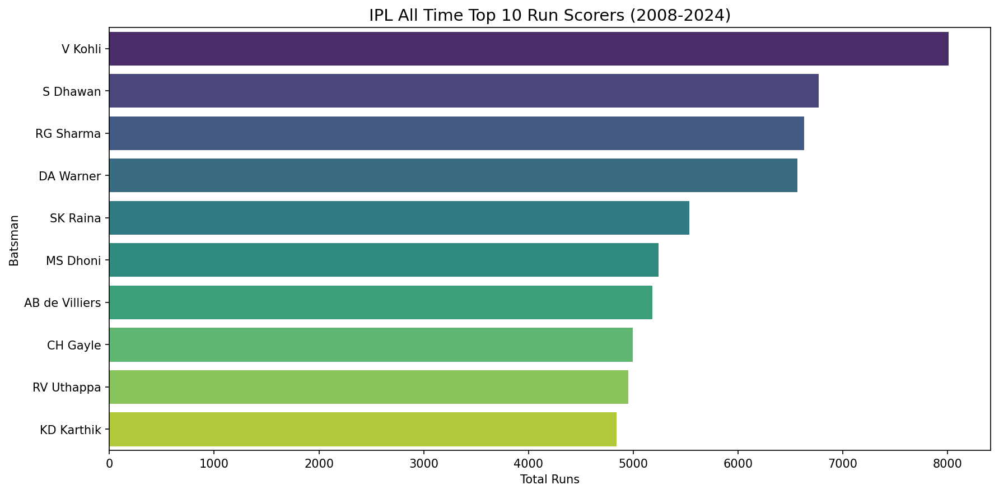
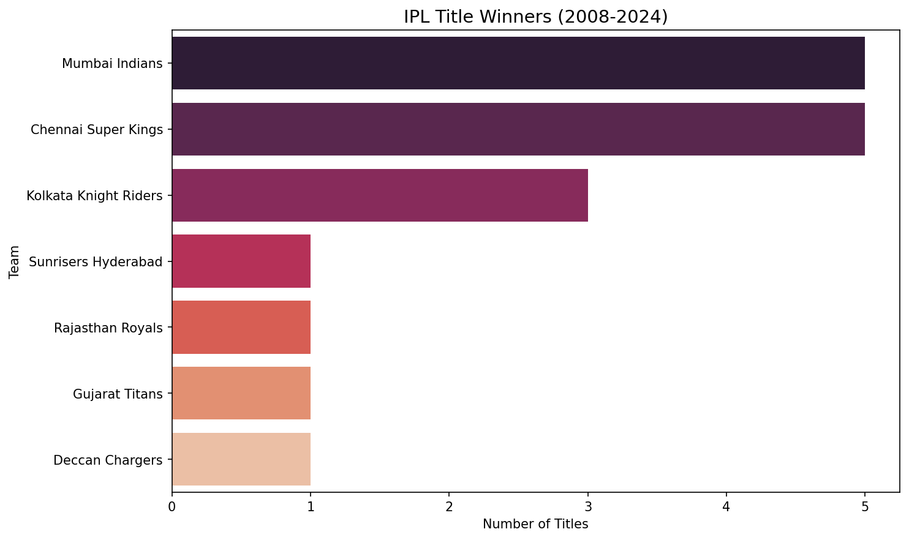
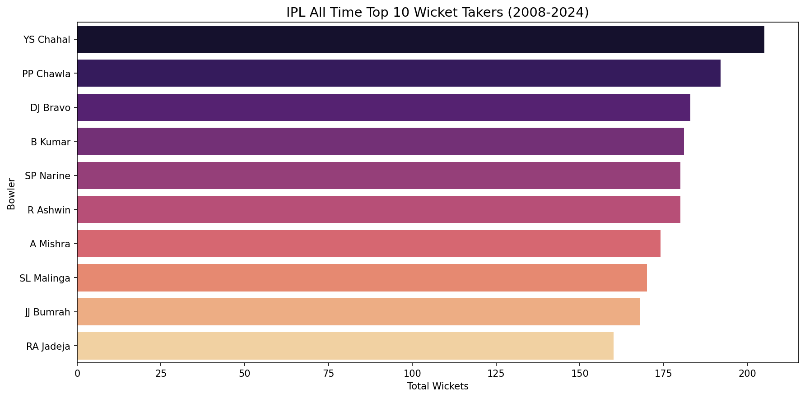
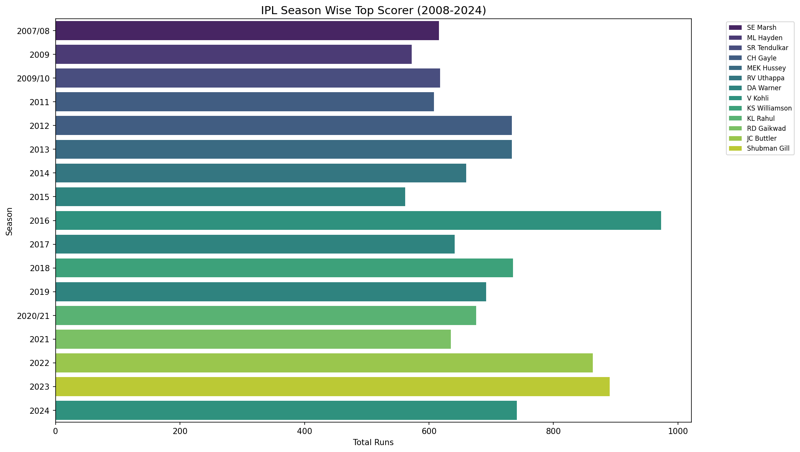
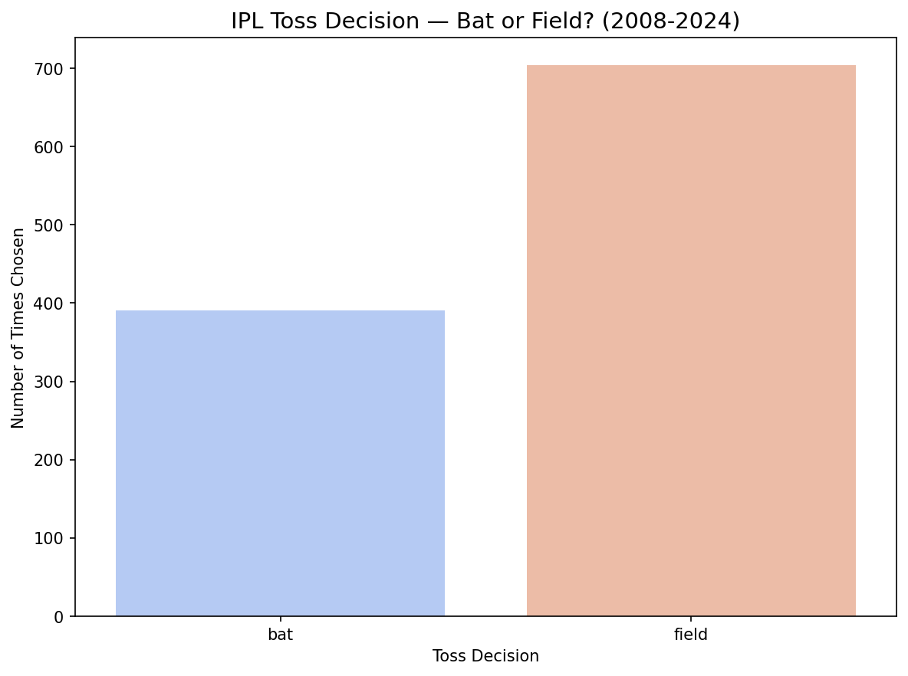

# 🏏 IPL Cricket Analytics — SQL Database Project

[](https://python.org)
[](https://sqlite.org)
[](https://pandas.pydata.org)
[](https://seaborn.pydata.org)

> **A complete IPL cricket analytics system built using SQLite, Python, and SQL — answering real business questions from 17 seasons of IPL data (2008-2024)**

---

## 📋 Table of Contents

1. [Project Overview](#project-overview)
2. [Problem Statement](#problem-statement)
3. [Dataset Description](#dataset-description)
4. [Database Schema](#database-schema)
5. [Project Structure](#project-structure)
6. [How to Run](#how-to-run)
7. [SQL Queries Explained](#sql-queries-explained)
8. [Key Insights Found](#key-insights-found)
9. [Visualisations](#visualisations)
10. [Python + SQL Integration](#python--sql-integration)
11. [Hypotheses Tested](#hypotheses-tested)
12. [What I Learned](#what-i-learned)
13. [Tech Stack](#tech-stack)
14. [Future Enhancements](#future-enhancements)

---

## 🎯 Project Overview

The Indian Premier League (IPL) is one of the most data-rich sporting events in the world. Every match, every ball, every run is recorded. This project builds a complete **relational SQLite database** from raw IPL CSV files and uses **SQL queries** to extract meaningful insights — answering questions that team management, broadcasters, and cricket analysts ask every season.

This is not just a data analysis project — it demonstrates the complete pipeline of a **Data Science workflow:**

```
Raw CSV Files → SQLite Database → SQL Queries → Python Integration → Visualisations → Insights
```

---

## ❓ Problem Statement

Given 17 seasons of IPL data (2008-2024) stored across two CSV files:

- **Who are the greatest batsmen and bowlers in IPL history?**
- **Which teams have dominated the tournament?**
- **Does winning the toss actually help win the match?**
- **How has IPL batting evolved season by season?**
- **What does the data say about the MI vs CSK rivalry?**

---

## 📊 Dataset Description

**Source:** Kaggle — IPL Complete Dataset (2008-2024)  
**Author:** Prateek Bhardwaj  
**Usability Score:** 10/10  
**License:** Database Open License

### matches.csv
- **Shape:** 1095 rows × 20 columns
- **Description:** One row per IPL match — match summary level data
- **Key columns:**

| Column | Description |
|--------|-------------|
| id | Unique match identifier |
| season | IPL season year |
| city | City where match was played |
| date | Match date |
| match_type | League/Qualifier/Final etc |
| team1 | First team |
| team2 | Second team |
| toss_winner | Team that won the toss |
| toss_decision | Bat or field |
| winner | Match winner |
| result_margin | Winning margin (runs or wickets) |
| player_of_match | Best player award |
| venue | Stadium name |

### deliveries.csv
- **Shape:** 260,920 rows × 17 columns
- **Description:** One row per delivery — ball by ball data
- **Key columns:**

| Column | Description |
|--------|-------------|
| match_id | Links to matches.id |
| inning | Innings number (1 or 2) |
| batting_team | Team currently batting |
| bowling_team | Team currently bowling |
| over | Over number |
| ball | Ball number within over |
| batter | Batsman facing |
| bowler | Bowler bowling |
| batsman_runs | Runs scored by batsman |
| extra_runs | Extra runs (wide, no-ball etc) |
| total_runs | Total runs on that delivery |
| is_wicket | 1 if wicket fell, 0 otherwise |
| dismissal_kind | How batsman was dismissed |

---

## 🗄️ Database Schema

```sql
-- Table 1: matches (1095 rows)
CREATE TABLE matches (
    id INTEGER PRIMARY KEY,
    season TEXT,
    city TEXT,
    date TEXT,
    match_type TEXT,
    player_of_match TEXT,
    venue TEXT,
    team1 TEXT,
    team2 TEXT,
    toss_winner TEXT,
    toss_decision TEXT,
    winner TEXT,
    result TEXT,
    result_margin REAL,
    target_runs REAL,
    target_overs REAL,
    super_over TEXT,
    method TEXT,
    umpire1 TEXT,
    umpire2 TEXT
);

-- Table 2: deliveries (260,920 rows)
CREATE TABLE deliveries (
    match_id INTEGER,
    inning INTEGER,
    batting_team TEXT,
    bowling_team TEXT,
    over INTEGER,
    ball INTEGER,
    batter TEXT,
    bowler TEXT,
    non_striker TEXT,
    batsman_runs INTEGER,
    extra_runs INTEGER,
    total_runs INTEGER,
    extras_type TEXT,
    is_wicket INTEGER,
    player_dismissed TEXT,
    dismissal_kind TEXT,
    fielder TEXT,
    FOREIGN KEY (match_id) REFERENCES matches(id)
);
```

**Relationship:** `deliveries.match_id` → `matches.id`
One match has hundreds of deliveries — classic one-to-many relationship!

---

## 📁 Project Structure

```
05-sql-project/
├── data/                          ← Raw CSVs (gitignored!)
│   ├── matches.csv
│   └── deliveries.csv
├── database/                      ← SQLite DB (gitignored!)
│   └── ipl.db
├── queries/                       ← All SQL queries
│   ├── 01_basic_queries.sql
│   ├── 02_aggregations.sql
│   ├── 03_joins.sql
│   ├── 04_subqueries.sql
│   └── 05_advanced.sql
├── src/                           ← Python source files
│   ├── ipl_cricket_analytics.py   ← Main analysis file
├── screenshots/                   ← All visualisations
│   ├── top_batsmen.png
│   ├── team_titles.png
│   ├── top_bowlers.png
│   ├── season_top_scorers.png
│   └── toss_analysis.png
├── insights.md                    ← Key findings in plain English
├── requirements.txt
├── .gitignore
└── README.md
```

---

## 🚀 How to Run

### Prerequisites
```bash
pip install pandas==2.2.2 matplotlib seaborn numpy
```

> Note: `sqlite3` is built into Python — no installation needed!

### Steps

**1. Clone the repository:**
```bash
git clone https://github.com/your-username/ml-ai-portfolio
cd ml-ai-portfolio/05-sql-project
```

**2. Download the dataset:**
- Go to: [Kaggle IPL Complete Dataset](https://www.kaggle.com/datasets)
- Download matches.csv and deliveries.csv
- Place both files in the `data/` folder

**3. Run the analysis:**
```bash
python src/ipl_cricket_analytics.py
```

**4. View results:**
- Charts saved in `screenshots/` folder
- Key insights in `insights.md`

---

## 🔍 SQL Queries Explained

### Basic Queries

**Q1 — Total wins per team:**
```sql
SELECT winner, COUNT(*) as total_wins
FROM matches
WHERE winner IS NOT NULL
GROUP BY winner
ORDER BY total_wins DESC;
```
Uses `GROUP BY` to aggregate wins per team. `WHERE winner IS NOT NULL` excludes no-result matches.

---

**Q2 — IPL Title Winners (Finals only):**
```sql
SELECT winner, COUNT(*) as titles
FROM matches
WHERE match_type = 'Final'
AND winner IS NOT NULL
GROUP BY winner
ORDER BY titles DESC;
```
Filters only Final matches — this gives actual IPL championships, not just overall wins!

**Key distinction:** Total wins ≠ IPL titles. This query isolates only the most important matches!

---

**Q3 — Top 10 batsmen all time:**
```sql
SELECT batter, SUM(batsman_runs) as total_runs
FROM deliveries
GROUP BY batter
ORDER BY total_runs DESC
LIMIT 10;
```
Aggregates all runs from 260,920 deliveries. `SUM` with `GROUP BY` collapses all deliveries per batsman into one row.

---

**Q4 — Top wicket takers:**
```sql
SELECT bowler, COUNT(*) as total_wickets
FROM deliveries
WHERE is_wicket = 1
AND dismissal_kind NOT IN ('run out', 'retired hurt', 'obstructing the field')
GROUP BY bowler
ORDER BY total_wickets DESC
LIMIT 10;
```
Filters only bowler wickets — excludes run outs (fielder's credit) and retired hurts!

---

**Q5 — Toss analysis:**
```sql
SELECT 
    COUNT(*) as total_matches,
    SUM(CASE WHEN toss_winner = winner THEN 1 ELSE 0 END) as toss_winner_won,
    ROUND(SUM(CASE WHEN toss_winner = winner THEN 1 ELSE 0 END) * 100.0 / COUNT(*), 2) as win_percentage
FROM matches
WHERE winner IS NOT NULL;
```
Uses `CASE WHEN` — SQL's if-else — to check if toss winner also won the match!

---

### JOIN Query

**Q6 — Season wise batting stats (matches + deliveries JOIN):**
```sql
SELECT m.season, 
       d.batter,
       SUM(d.batsman_runs) as season_runs
FROM matches m
INNER JOIN deliveries d ON m.id = d.match_id
GROUP BY m.season, d.batter
ORDER BY m.season, season_runs DESC;
```
Joins two tables using `match_id` — combines season information from matches table with ball-by-ball data from deliveries table!

---

### CTE + Window Function Query

**Q7 — Season wise top scorer:**
```sql
WITH season_runs AS (
    SELECT m.season,
           d.batter,
           SUM(d.batsman_runs) as total_runs
    FROM deliveries d
    JOIN matches m ON d.match_id = m.id
    GROUP BY m.season, d.batter
),
ranked AS (
    SELECT season, batter, total_runs,
           RANK() OVER (
               PARTITION BY season 
               ORDER BY total_runs DESC
           ) as rnk
    FROM season_runs
)
SELECT season, batter, total_runs
FROM ranked
WHERE rnk = 1
ORDER BY season;
```
Two CTEs chained together! `season_runs` calculates totals, `ranked` applies window function to rank within each season, final SELECT filters rank 1 only!

---

## 💡 Key Insights Found

### 1. IPL Title Race — MI and CSK Dominate
- Mumbai Indians: **5 titles**
- Chennai Super Kings: **5 titles**
- Both teams are tied as most successful franchises!
- No other team comes close — speaks to organizational excellence!

### 2. All Time Top Scorer — Virat Kohli
- Virat Kohli leads all time run scoring charts
- His **2016 season (973 runs)** is the greatest individual IPL batting season ever!
- David Warner dominated most seasons — topped 3 times (2015, 2017, 2019)

### 3. Toss Myth Busted!
- Toss winner wins only **50.83%** of matches
- Statistically — toss is almost meaningless!
- Yet 70% of toss winners choose to field first
- Captains prefer chasing — but it doesn't actually help!

### 4. Bowling — Chahal on Top
- Yuzvendra Chahal leads all time wicket takers with **205 wickets**
- Leg spin dominates IPL bowling charts

### 5. Season Evolution
- Early IPL (2007-2010): Overseas stars dominated (Marsh, Hayden, Tendulkar)
- Middle era (2011-2016): Gayle and Kohli era
- Modern era (2022-2024): New generation — Buttler (863), Shubman Gill (890)

---

## 📈 Visualisations

### Top 10 IPL Run Scorers All Time


### IPL Title Winners (2008-2024)


### Top 10 Wicket Takers All Time


### Season Wise Top Scorer


### Toss Decision Analysis


---

## 🐍 Python + SQL Integration

The core of this project is the seamless integration between Python and SQLite:

```python
import sqlite3
import pandas as pd

# Connect to database
conn = sqlite3.connect('database/ipl.db')

# Load CSVs into SQLite — one line each!
matches.to_sql('matches', conn, if_exists='replace', index=False)
deliveries.to_sql('deliveries', conn, if_exists='replace', index=False)

# Run SQL → get Pandas DataFrame
query = """
    SELECT batter, SUM(batsman_runs) as total_runs
    FROM deliveries
    GROUP BY batter
    ORDER BY total_runs DESC
    LIMIT 10
"""
df = pd.read_sql_query(query, conn)

# From here — full Pandas + Seaborn power!
conn.close()
```

**`pd.read_sql_query()`** is the bridge — SQL result becomes a Pandas DataFrame instantly!

---

## 🧪 Hypotheses Tested

| Hypothesis | Result | Finding |
|---|---|---|
| CSK or MI have most titles | ✅ CONFIRMED | Both have 5 titles each! |
| Virat Kohli is all time top scorer | ✅ CONFIRMED | Kohli leads the charts! |
| Toss winner has advantage | ❌ BUSTED | Only 50.83% win rate! |
| Teams prefer fielding after toss | ✅ CONFIRMED | 70% choose to field! |

---

## 📚 What I Learned

**SQL Skills:**
- Writing complex queries with GROUP BY, HAVING, JOIN
- Using CTEs for readable multi-step queries
- Window functions (RANK, PARTITION BY) for ranking within groups
- CASE WHEN for conditional aggregation
- The difference between wins and titles — always ask the right question!

**Python + SQL Integration:**
- sqlite3 library — connecting Python to databases
- `to_sql()` — loading DataFrames into SQLite
- `pd.read_sql_query()` — SQL results as DataFrames
- Full pipeline: CSV → Database → SQL → DataFrame → Visualisation

**Data Thinking:**
- Always verify: total wins ≠ titles
- Null handling — excluding no-result matches
- Domain knowledge matters — knowing run outs aren't bowler wickets!
- Data can bust popular myths (toss advantage!)

---

## 🛠️ Tech Stack

| Technology | Purpose |
|---|---|
| Python 3.x | Core programming |
| SQLite | Database engine |
| sqlite3 | Python-SQLite bridge |
| Pandas 2.2.2 | Data manipulation |
| Matplotlib | Base visualisation |
| Seaborn | Statistical charts |
| SQL | Data querying |
| Google Colab | Development environment |
| Git + GitHub | Version control |

---

## 🚀 Future Enhancements

1. **Streamlit Dashboard** — Interactive web app for IPL analytics
2. **More queries** — Economy rates, strike rates, partnership analysis
3. **Season comparison** — How has scoring evolved over 17 seasons?
4. **Venue analysis** — Which grounds favour batsmen vs bowlers?
5. **Head to head** — Complete MI vs CSK rivalry breakdown
6. **Recent seasons** — Add 2025 season data when available
7. **PDF Report** — Auto-generated insights report using reportlab

---

## 👨‍💻 Author

**Prajwal Kondala**  
IIT Kharagpur | B.Tech  
DS/AI Journey — February 2026 onwards  

[](https://github.com/your-username)

---

*Project 05 of 22 — DS/AI Portfolio*  
*Built with cricket passion and SQL love! 🏏*
