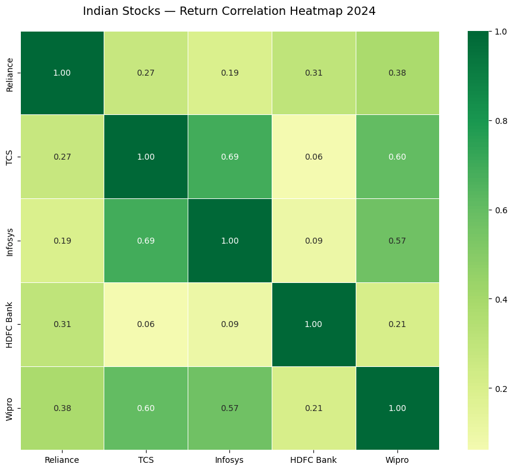
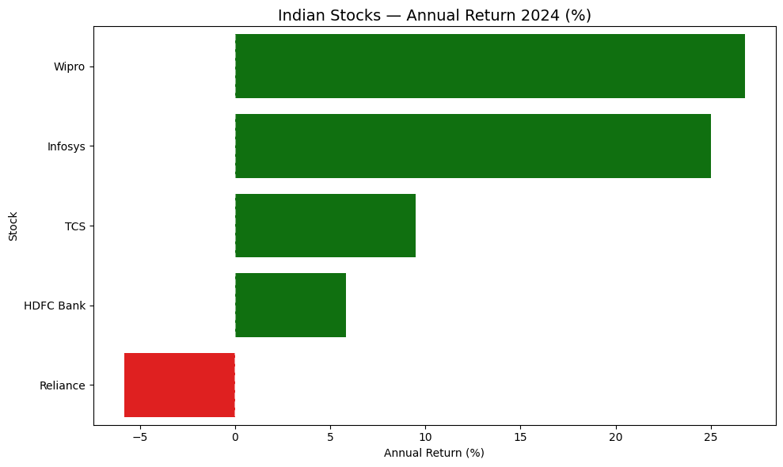

# 📈 Indian Stock Market Dashboard

[](https://python.org)
[](https://plotly.com)
[](https://pypi.org/project/yfinance/)
[](https://pandas.pydata.org)

> **A complete interactive stock market dashboard analyzing 5 major Indian stocks using real-time Yahoo Finance data — candlestick charts, moving averages, correlation analysis, and volatility comparison.**

---

## 📋 Table of Contents

1. [Project Overview](#project-overview)
2. [Problem Statement](#problem-statement)
3. [Dataset Description](#dataset-description)
4. [Project Structure](#project-structure)
5. [How to Run](#how-to-run)
6. [Key Insights Found](#key-insights-found)
7. [Visualisations](#visualisations)
8. [What I Learned](#what-i-learned)
9. [Tech Stack](#tech-stack)
10. [Future Enhancements](#future-enhancements)

---

## 🎯 Project Overview

This project builds a complete stock market analytics dashboard for 5 major Indian stocks listed on NSE (National Stock Exchange). Unlike static datasets, this project fetches **live data directly from Yahoo Finance** using the yfinance API — making it always up to date!

**Stocks Analyzed:**
- Reliance Industries (RELIANCE.NS)
- Tata Consultancy Services (TCS.NS)
- Infosys (INFY.NS)
- HDFC Bank (HDFCBANK.NS)
- Wipro (WIPRO.NS)

**Period:** January 2024 — January 2025 (246 trading days)

---

## ❓ Problem Statement

Given one year of Indian stock market data:

- **Which stock gave the best return in 2024?**
- **Which stock was most volatile (risky)?**
- **Are IT stocks correlated with each other?**
- **Does high risk lead to high reward?**
- **How did Reliance perform vs IT sector?**

---

## 📊 Dataset Description

**Source:** Yahoo Finance via yfinance API (live data!)
**No CSV files needed** — data fetched directly at runtime!

**OHLC Data per stock:**

| Column | Description |
|--------|-------------|
| Date | Trading day (weekdays only — ~246 per year) |
| Open | Price when market opened (9:15 AM IST) |
| High | Highest price touched during the day |
| Low | Lowest price touched during the day |
| Close | Final price when market closed (3:30 PM IST) |
| Volume | Number of shares traded |

**Why 246 rows not 365?**
Stock market is closed on weekends and public holidays!
Only actual trading days are recorded!

---

## 📁 Project Structure

```
06-stock-market-dashboard/
├── src/
│   └── stock_market_dashboard.py   ← Main analysis file
├── screenshots/
│   ├── reliance_candlestick.html   ← Interactive candlestick!
│   ├── multi_stock_comparison.html ← Normalized performance
│   ├── correlation_heatmap.png     ← Seaborn heatmap
│   ├── volatility_comparison.html  ← Rolling volatility
│   └── returns_analysis.png        ← Annual returns bar chart
├── requirements.txt
├── .gitignore
└── README.md
```

---

## 🚀 How to Run

### Prerequisites
```bash
pip install pandas==2.2.2 matplotlib seaborn plotly yfinance
```

### Steps
```bash
git clone https://github.com/your-username/ml-ai-portfolio
cd ml-ai-portfolio/06-stock-market-dashboard
python src/stock_market_dashboard.py
```

All charts will be saved in `screenshots/` folder automatically!

---

## 💡 Key Insights Found

### 1. Annual Returns 2024 — IT Sector Dominates!

```
🏆 Wipro      → +26.79%  ← Best performer!
🥈 Infosys    → +25.02%
🥉 TCS        → +9.50%
   HDFC Bank  → +5.83%
📉 Reliance   → -5.83%   ← Only negative return!
```

**Biggest surprise:** Reliance Industries — India's largest company by market cap — was the ONLY stock with negative returns in 2024!

### 2. High Risk → High Reward Confirmed!

Wipro was simultaneously:
- **Best performer** (+26.79% annual return)
- **Most volatile** (peak 2.5% daily swing in July 2024)
- **Highest mean daily return** (0.11%)

Classic finance principle confirmed by real data!

### 3. Correlation Analysis — Diversification Insights!

```
Most correlated:  TCS & Infosys = 0.69
Least correlated: HDFC & TCS   = 0.06
```

**Portfolio lesson:**
- Buying TCS + Infosys = poor diversification (0.69 correlated!)
- Buying TCS + HDFC = excellent diversification (0.06 — nearly independent!)

IT stocks move together (same USD/INR exposure, same US clients)
Banking + IT are almost completely independent!

### 4. July 2024 — Market Volatility Spike!

All 5 stocks showed simultaneous volatility spike in July 2024 — visible in rolling volatility chart. Major market event affected entire Indian market regardless of sector!

### 5. Reliance January Surge — Temporary!

Reliance surged from ₹1285 to ₹1437 in January 2024 (+12% in one month!) — but gave back all gains and ended the year at -5.83%. January surge was temporary, not sustained!

---

## 📈 Visualisations

### Reliance Candlestick + Moving Averages
Interactive HTML — open `screenshots/reliance_candlestick.html`
- Green/Red candles showing daily price movement
- Orange line = 20-day moving average (short term trend)
- Blue line = 50-day moving average (long term trend)

### Normalized Performance Comparison
Interactive HTML — open `screenshots/multi_stock_comparison.html`
All stocks normalized to base 100 for fair comparison!

### Correlation Heatmap


### 30-Day Rolling Volatility
Interactive HTML — open `screenshots/volatility_comparison.html`

### Annual Returns 2024


---

## 📚 What I Learned

**Technical Skills:**
- yfinance API — fetching live financial data
- OHLC data structure — Open, High, Low, Close
- Candlestick charts using Plotly Graph Objects
- Moving averages — rolling window calculations
- Daily returns — percentage change calculation
- Correlation analysis between multiple assets
- Rolling volatility — standard deviation of returns
- Interactive HTML charts vs static PNG

**Finance Concepts:**
- Indian stock market — NSE, .NS ticker suffix
- 246 trading days per year (not 365!)
- High risk = high reward relationship
- Portfolio diversification through low correlation
- Moving averages as trend indicators
- Volatility as a measure of risk

**Data Thinking:**
- Normalize prices for fair multi-stock comparison
- Absolute price comparison is misleading
- Correlation ≠ causation (TCS and Infosys move together because of shared macro factors)
- Short term surges don't always indicate long term trends (Reliance January!)

---

## 🛠️ Tech Stack

| Technology | Purpose |
|---|---|
| Python 3.x | Core programming |
| yfinance | Live stock data from Yahoo Finance |
| Pandas 2.2.2 | Data manipulation |
| Plotly Graph Objects | Interactive candlestick charts |
| Plotly Express | Quick interactive charts |
| Seaborn | Correlation heatmap |
| Matplotlib | Static charts |
| Google Colab | Development environment |
| Git + GitHub | Version control |

---

## 🚀 Future Enhancements

1. **Streamlit App** — interactive web dashboard with date picker
2. **More stocks** — add NIFTY50 index, mid-cap stocks
3. **Technical indicators** — RSI, MACD, Bollinger Bands
4. **52-week high/low** — markers on candlestick chart
5. **Volume analysis** — correlate volume spikes with price movements
6. **Sector comparison** — IT vs Banking vs Energy vs Pharma
7. **Prediction** — simple moving average crossover strategy backtest

---

## 👨‍💻 Author

**Prajwal Kondala**
IIT Kharagpur | B.Tech
DS/AI Journey — February 2026 onwards

---

*Project 06 of 22 — DS/AI Portfolio*
*Built with curiosity about Indian markets! 📈*
