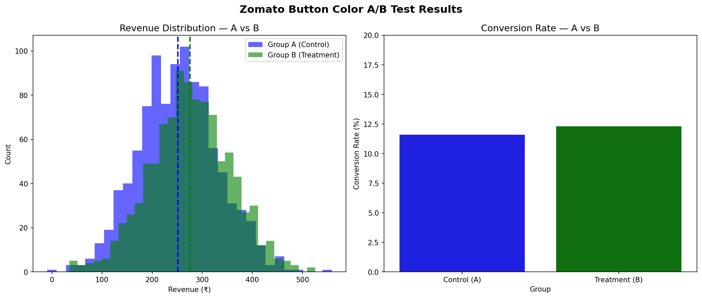

# 🧪 A/B Testing Analysis Tool

[](https://python.org)
[](https://scipy.org)
[](https://reportlab.com)
[](https://pandas.pydata.org)

> **A production-ready A/B testing tool that automates statistical analysis — input two groups, get p-value, lift, confidence intervals, and a professional PDF report automatically!**

---

## 📋 Table of Contents

1. [Project Overview](#project-overview)
2. [Problem Statement](#problem-statement)
3. [How It Works](#how-it-works)
4. [Project Structure](#project-structure)
5. [How to Run](#how-to-run)
6. [Statistical Methods](#statistical-methods)
7. [Key Results](#key-results)
8. [Visualisations](#visualisations)
9. [What I Learned](#what-i-learned)
10. [Tech Stack](#tech-stack)
11. [Future Enhancements](#future-enhancements)

---

## 🎯 Project Overview

Every tech company runs A/B tests — Zomato tests button colors, Swiggy tests delivery algorithms, Amazon tests page layouts. But analyzing these tests manually is time consuming and error prone.

This tool **automates the entire A/B testing pipeline:**

```
Input two groups → Statistical analysis → Decision → PDF Report
```

No manual calculations — just run the function and get a professional report!

---

## ❓ Problem Statement

Given two groups of data (Control A vs Treatment B):

- **Is the difference statistically significant or just luck?**
- **What is the lift — how much better is B than A?**
- **Should we ship Treatment B or keep Control A?**
- **What does the 95% confidence interval tell us?**

This tool answers ALL these questions automatically!

---

## ⚙️ How It Works

```python
# One function call — complete analysis!
run_ab_test(
    group_a=control_data,
    group_b=treatment_data,
    metric_name='Revenue (Rs.)',
    alpha=0.05
)
```

**Output:**
- Descriptive statistics (mean, std, n)
- T-statistic and p-value
- Lift percentage
- 95% Confidence Interval
- Clear recommendation — Ship B or Keep A!
- Auto-generated PDF report!

---

## 📁 Project Structure

```
07-ab-testing-tool/
├── src/
│   └── ab_testing_tool.py    ← Main tool
├── screenshots/
│   └── ab_test_results.png   ← Distribution charts
├── ab_test_report.pdf        ← Auto-generated report!
├── requirements.txt
├── .gitignore
└── README.md
```

---

## 🚀 How to Run

### Prerequisites
```bash
pip install pandas==2.2.2 numpy matplotlib seaborn scipy reportlab
```

### Run the tool
```bash
python src/ab_testing_tool.py
```

### Use in your own project
```python
from ab_testing_tool import run_ab_test, generate_ab_report
import numpy as np

# Your data
control = np.array([...])    # Group A data
treatment = np.array([...])  # Group B data

# Run analysis
run_ab_test(control, treatment, metric_name='Your Metric')

# Generate PDF report
generate_ab_report(control, treatment,
                   metric_name='Your Metric',
                   test_name='Your Test Name',
                   filename='report.pdf')
```

---

## 📐 Statistical Methods

### T-Test (for continuous metrics)
Used for metrics like revenue, time spent, page views.

```
H₀: Mean(A) = Mean(B)  — no difference
H₁: Mean(A) ≠ Mean(B)  — real difference exists

p < 0.05 → Reject H₀ → Difference is REAL!
p > 0.05 → Fail to reject H₀ → Could be luck!
```

### Chi-Square Test (for conversion rates)
Used for binary metrics like clicked/not clicked, converted/not converted.

```
H₀: Conversion rate A = Conversion rate B
H₁: Conversion rates are different

Same p-value interpretation as t-test!
```

### Lift
```
Lift = (Mean B - Mean A) / Mean A × 100%

Positive lift → B is better!
Negative lift → A is better!
```

### 95% Confidence Interval
```
CI = Difference ± 1.96 × Standard Error

Both bounds positive → B definitely better!
Both bounds negative → A definitely better!
CI crosses zero → Uncertain — need more data!
```

---

## 💡 Key Results

### Test 1 — Zomato Button Color Test
**Question:** Does green button generate more revenue than blue?

```
Control A (Blue):   Mean = Rs.251.55, n=1000
Treatment B (Green): Mean = Rs.275.67, n=1000

Lift:      +9.59%
P-value:   0.0000 ✅ SIGNIFICANT!
95% CI:    [17.19, 31.05] — both positive!

Decision: SHIP the green button!
Business impact: Rs.24 more per user
At 1M users/day = Rs.2.4 CRORE extra revenue!
```

### Test 2 — Zomato Conversion Rate Test
**Question:** Does green button convert more users?

```
Control A:   11.60% conversion
Treatment B: 12.30% conversion

Lift:      +6.03%
P-value:   0.6792 ❌ NOT SIGNIFICANT!

Decision: Keep blue button for conversions!
The 0.7% difference is just random chance!
```

### Test 3 — Swiggy Delivery Algorithm Test
**Question:** Does new algorithm reduce delivery time?

```
Old Algorithm: Mean = 34.69 minutes
New Algorithm: Mean = 32.68 minutes

Lift:      -5.81% (negative = worse!)
P-value:   0.0001 ✅ SIGNIFICANT!
95% CI:    [-3.01, -1.02] — both negative!

Decision: Keep OLD algorithm!
New algorithm is significantly SLOWER!
Would add 1-3 minutes to every delivery!
```

---

## 🔑 Key Insight — Conflicting Signals!

The Zomato test showed something important:

```
Revenue test    → ✅ Ship green button!
Conversion test → ❌ Keep blue button!
```

**Two metrics — two different conclusions!**

This is realistic — in real A/B tests, different metrics often disagree.
The data scientist's job = present ALL evidence + give ONE clear recommendation!

**Final recommendation:** Ship green button based on revenue impact — the primary business metric!

---

## 📊 Visualisations

### Distribution Comparison + Conversion Rates


### Auto-Generated PDF Report
See `ab_test_report.pdf` for the complete professional report!

---

## 📚 What I Learned

**Statistical Concepts:**
- T-test for continuous data (revenue, time, scores)
- Chi-square test for categorical data (conversions, clicks)
- P-value interpretation — significance vs luck
- Lift calculation — business impact metric
- Confidence intervals — range of true effect
- Type I error (false positive) — shipping a bad variant!
- Type II error (false negative) — missing a good variant!

**Engineering Skills:**
- Building reusable statistical functions
- Automating analysis pipeline
- PDF report generation with ReportLab
- Professional output formatting

**Business Thinking:**
- Different metrics can give conflicting signals
- Statistical significance ≠ business significance
- Effect size matters as much as p-value
- Sample size affects test power

---

## 🛠️ Tech Stack

| Technology | Purpose |
|---|---|
| Python 3.x | Core programming |
| SciPy Stats | T-test, Chi-square test |
| NumPy | Array operations, simulations |
| Pandas | Data manipulation |
| Matplotlib | Distribution plots |
| Seaborn | Statistical visualisations |
| ReportLab | PDF report generation |
| Google Colab | Development environment |
| Git + GitHub | Version control |

---

## 🚀 Future Enhancements

1. **Streamlit App** — web interface for non-technical users
2. **Multiple variants** — A/B/C/D testing support
3. **Bayesian A/B testing** — alternative to frequentist approach
4. **Sequential testing** — stop test early when significant
5. **Sample size calculator** — how many users needed?
6. **Bonferroni correction** — multiple comparison adjustment
7. **Real dataset support** — upload CSV instead of simulated data
8. **Email report** — auto-send PDF to stakeholders

---

## 👨‍💻 Author

**Prajwal Kondala**
IIT Kharagpur | B.Tech
DS/AI Journey — February 2026 onwards

---

*Project 07 of 22 — DS/AI Portfolio*
*Built for every product team that runs experiments! 🧪*
