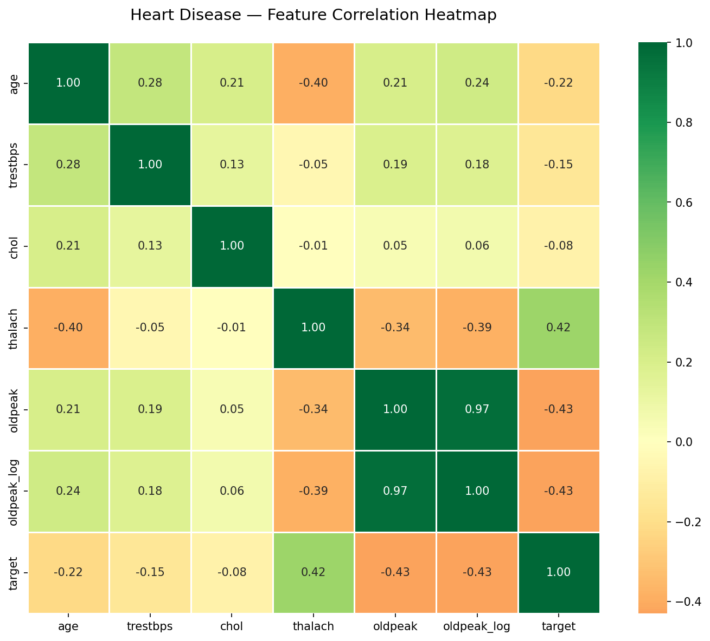
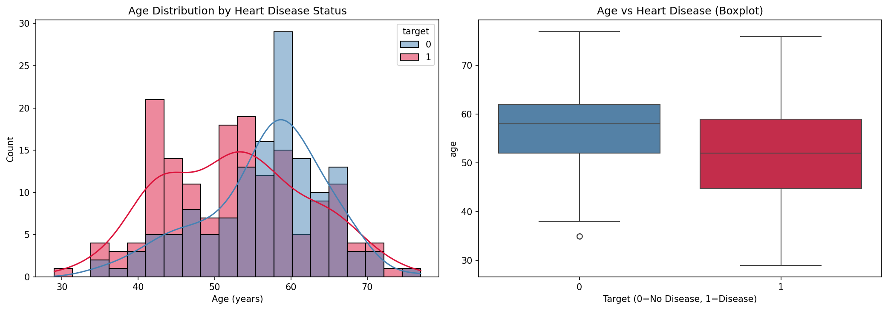
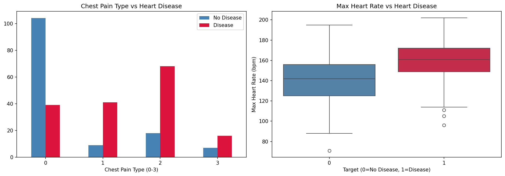
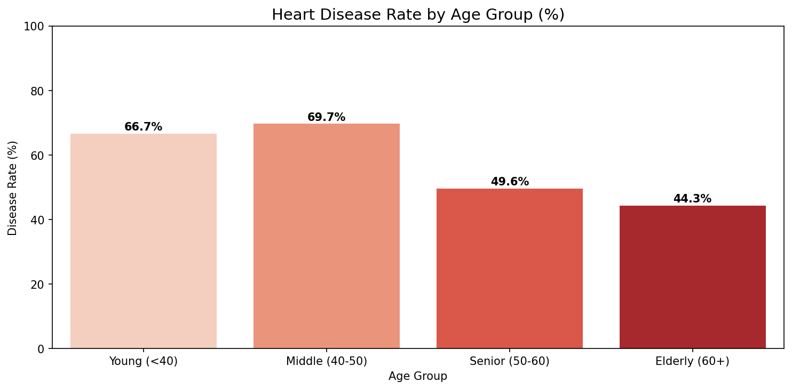

# 🏥 Healthcare Data Analytics Pipeline

[](https://python.org)
[](https://pandas.pydata.org)
[](YOUR_STREAMLIT_URL_HERE)
[](https://plotly.com)
[](https://scipy.org)
[](https://reportlab.com)

> **An end-to-end healthcare data analytics pipeline analyzing the Cleveland Heart Disease dataset — featuring automated data cleaning, feature engineering, statistical hypothesis testing, interactive visualizations, and a live Streamlit dashboard!**

---

## 🔥 Key Highlights (TL;DR)

- Reduced dataset from **1,025 → 302 rows** (removed 70.5% duplicates!)
- Strongest numeric predictor: **thalach/Max Heart Rate (+0.42 correlation)**
- Strongest negative predictor: **oldpeak/ST Depression (-0.43)**
- Cholesterol shows **near-zero correlation (-0.08) — poor predictor!**
- Chest pain type is the **strongest categorical predictor**
- All **3 hypothesis tests rejected H0** (p ≤ 0.0001)
- Built **end-to-end pipeline + live Streamlit dashboard!**

---

## 🚀 Live Demo

🔗 **[Healthcare Analytics Dashboard — Live App](YOUR_STREAMLIT_URL_HERE)**

*Explore 302 patient records interactively — filter by age, gender, disease status!*

---

## 📋 Table of Contents

1. [Project Overview](#project-overview)
2. [Problem Statement](#problem-statement)
3. [Dataset](#dataset)
4. [Project Structure](#project-structure)
5. [Methodology](#methodology)
6. [Data Cleaning](#data-cleaning)
7. [Feature Engineering](#feature-engineering)
8. [Exploratory Data Analysis](#exploratory-data-analysis)
9. [Statistical Hypothesis Testing](#statistical-hypothesis-testing)
10. [Key Insights](#key-insights)
11. [Business Interpretation](#business-interpretation)
12. [Visualizations](#visualizations)
13. [Streamlit Dashboard](#streamlit-dashboard)
14. [Tech Stack](#tech-stack)
15. [How to Run](#how-to-run)
16. [What I Learned](#what-i-learned)
17. [Limitations](#limitations)
18. [Future Improvements](#future-improvements)
19. [Author](#author)

---

## 🎯 Project Overview

Every year, cardiovascular diseases claim millions of lives globally. Early detection is critical — but which clinical features actually predict heart disease?

This project builds a **complete data science pipeline** on the Cleveland Heart Disease dataset to answer:

- Which clinical features are strongest predictors of heart disease?
- Do traditional risk factors (age, cholesterol, BP) actually predict disease?
- Are there counterintuitive patterns hidden in the data?
- Can we visualize these insights in an interactive dashboard?

**The analysis reveals several counterintuitive patterns in clinical indicators.**

---

## ❓ Problem Statement

Given 13 clinical measurements from 302 patients:

> Can we identify which features are most strongly associated with heart disease presence? And what patterns does the data reveal that challenge traditional medical assumptions?

This is a **data analytics and insight generation** project — not a prediction model. The goal is to deeply understand what the data reveals about heart disease patterns.

---

## 📊 Dataset

| Property | Value |
|----------|-------|
| Source | [Heart Disease Dataset — Kaggle](https://www.kaggle.com/datasets/johnsmith88/heart-disease-dataset) |
| Origin | Cleveland Clinic Foundation, 1988 |
| Raw Rows | 1,025 |
| After Cleaning | **302 unique patients** |
| Duplicates Removed | 723 rows (70.5%!) |
| Features | 14 (13 clinical + 1 target) |
| Target | 0 = No Disease, 1 = Disease Present |
| Missing Values | **Zero** |
| Usability Score | 8.82/10 on Kaggle |

### Column Reference

| Column | Type | Description |
|--------|------|-------------|
| age | Numeric | Patient age (29-77 years) |
| sex | Categorical | 1=Male, 0=Female |
| cp | Categorical | Chest pain type (0-3) |
| trestbps | Numeric | Resting blood pressure (mm Hg) |
| chol | Numeric | Serum cholesterol (mg/dl) |
| fbs | Categorical | Fasting blood sugar >120: 1=Yes, 0=No |
| restecg | Categorical | Resting ECG results (0-2) |
| thalach | Numeric | Maximum heart rate achieved |
| exang | Categorical | Exercise induced angina: 1=Yes, 0=No |
| oldpeak | Numeric | ST depression (32.5% zeros — medically valid!) |
| slope | Categorical | ST slope (0-2) |
| ca | Categorical | Major vessels colored (0-3) |
| thal | Categorical | Thalassemia type (0-2) |
| target | Categorical | **1=Disease, 0=No Disease** |

---

## 📁 Project Structure

```
08-healthcare-capstone/
│
├── data/
│   ├── raw/
│   │   └── heart.csv                      ← Original! Never modified!
│   ├── processed/
│   │   └── heart_disease_cleaned.csv      ← After cleaning pipeline
│   └── README.md                          ← Dataset documentation
│
├── src/
│   └── pipeline.py                        ← Production code with docstrings
│
├── notebooks/
│   └── healthcare_analysis.ipynb          ← Complete development notebook
│
├── streamlit_app/
│   ├── app.py                             ← Interactive dashboard
│   ├── requirements.txt
│   └── heart_disease_cleaned.csv
│
├── screenshots/
│   ├── correlation_heatmap.png
│   ├── age_distribution.png
│   ├── chest_pain_heartrate.png
│   ├── age_group_disease_rate.png
│   ├── cholesterol_interactive.html
│   └── age_heartrate_interactive.html
│
├── reports/
│   ├── heart_disease_profile.html         ← ydata profiling report
│   └── healthcare_report.pdf              ← Professional PDF report
│
├── docs/
│   └── insights.md                        ← All key findings documented
│
├── tests/
│   └── test_pipeline.py                   ← Unit tests (pytest)
│
├── .gitignore
├── requirements.txt
└── README.md
```

---

## 🔬 Methodology

```
Step 1  → Data Loading + Validation
Step 2  → ydata Profiling (explorative mode!)
Step 3  → Data Cleaning Pipeline
Step 4  → Feature Engineering (5 new features!)
Step 5  → Exploratory Data Analysis
Step 6  → Statistical Hypothesis Testing (3 tests!)
Step 7  → Advanced GroupBy Analysis (NamedAgg!)
Step 8  → Visualizations (Seaborn + Plotly!)
Step 9  → Streamlit Dashboard → DEPLOYED LIVE!
Step 10 → PDF Report (reportlab!)
```

---

## 🧹 Data Cleaning

### The Duplicate Discovery — 70.5% Duplicate Rows!

```
Raw dataset   → 1,025 rows
Duplicates    → 723 rows (70.5%!)
Clean dataset → 302 unique patient records
```

This was the most critical cleaning step. After removal, the 302 remaining rows match exactly the original UCI Cleveland dataset used in medical research since 1988.

### Cleaning Steps

```
1. Remove 723 duplicate rows
2. Confirm zero missing values (all 14 columns!)
3. Fix data types — 9 columns disguised as integers → category!
   (sex, cp, fbs, restecg, exang, slope, ca, thal, target)
4. Validate no impossible values
   → No zero cholesterol ✅
   → No zero blood pressure ✅
   → oldpeak zeros are medically valid ✅
5. Save to data/processed/heart_disease_cleaned.csv
```

---

## ⚙️ Feature Engineering

Five new features created using Gap Topic 1 techniques:

### 1. age_group — pd.cut (Equal Width Bins)

```python
df['age_group'] = pd.cut(df['age'],
    bins=[0, 40, 50, 60, 100],
    labels=['Young (<40)', 'Middle (40-50)',
            'Senior (50-60)', 'Elderly (60+)'])
```

| Age Group | Patients | Disease Rate |
|-----------|---------|-------------|
| Young (<40) | 18 | 66.7% |
| Middle (40-50) | 76 | **69.7%** ← Highest! |
| Senior (50-60) | 129 | 49.6% |
| Elderly (60+) | 79 | 44.3% |

### 2. chol_risk — np.select (Multiple Conditions)

```python
conditions = [df['chol'] < 200,
              (df['chol'] >= 200) & (df['chol'] < 240),
              df['chol'] >= 240]
df['chol_risk'] = np.select(conditions,
    ['Normal', 'Borderline High', 'High Risk'],
    default='Unknown')
```

### 3. high_hr — np.where (Single Condition)

```python
df['high_hr'] = np.where(df['thalach'] > 150, 1, 0)
```

### 4. bp_category — pd.qcut (Equal Frequency Bins)

```python
df['bp_category'] = pd.qcut(df['trestbps'], q=4,
    labels=['Low', 'Normal', 'Elevated', 'High'])
```

### 5. oldpeak_log — np.log1p (Log Transform)

```python
df['oldpeak_log'] = np.log1p(df['oldpeak'])
# Skewness: 1.266 → 0.392 (much better!)
# log1p used because 32.5% zeros! (log(0) = undefined!)
```

**Result: 14 columns → 19 columns after engineering!**

---

## 📈 Exploratory Data Analysis

### Target Distribution

```
Disease Present (1) → 164 patients → 54.3%
No Disease (0)      → 138 patients → 45.7%
Near-perfect balance — no class imbalance handling needed!
```

### Correlation Analysis

| Feature | Correlation with Target |
|---------|------------------------|
| thalach (Max Heart Rate) | **+0.42** ← Strongest! |
| oldpeak (ST Depression) | -0.43 |
| age | -0.22 |
| trestbps (Blood Pressure) | -0.15 |
| chol (Cholesterol) | **-0.08** ← Weakest! |

### NamedAgg Age Group Analysis

```python
age_stats = df.groupby('age_group', observed=True).agg(
    patient_count=pd.NamedAgg(column='age', aggfunc='count'),
    avg_cholesterol=pd.NamedAgg(column='chol', aggfunc='mean'),
    avg_max_hr=pd.NamedAgg(column='thalach', aggfunc='mean'),
    disease_rate=pd.NamedAgg(column='target',
        aggfunc=lambda x: (x.astype(int)==1).mean()*100)
).reset_index()
```

| Age Group | Count | Avg Chol | Avg HR | Disease % |
|-----------|-------|----------|--------|-----------|
| Young (<40) | 18 | 215.0 | 169.3 | 66.7% |
| Middle (40-50) | 76 | 236.6 | 158.6 | 69.7% |
| Senior (50-60) | 129 | 248.4 | 147.8 | 49.6% |
| Elderly (60+) | 79 | 260.2 | 139.2 | 44.3% |

---

## 🧪 Statistical Hypothesis Testing

### Test 1 — Age vs Heart Disease (t-test)

```
H0: Mean age same for both groups
H1: Mean age differs between groups

Disease → 52.59 yrs | No Disease → 56.60 yrs
t = -3.9338 | p = 0.0001 | α = 0.05

→ REJECT H0 ✅ Age IS significantly different!
```

### Test 2 — Gender vs Heart Disease (Chi-square)

```
H0: Disease rate same for males and females
H1: Disease rate differs by gender

Female: 75% disease | Male: 44.7% disease
χ² = 23.0839 | p = 0.0000 | dof = 1

→ REJECT H0 ✅ Gender IS significantly associated!
```

### Test 3 — Max Heart Rate vs Heart Disease (t-test)

```
H0: Max heart rate same for both groups
H1: Max heart rate differs between groups

Disease → 158.38 bpm | No Disease → 139.10 bpm (19 bpm gap!)
t = 8.0148 | p = 0.0000 | α = 0.05

→ REJECT H0 ✅ MOST SIGNIFICANT TEST!
```

### Summary

| Test | Method | Statistic | p-value | Result |
|------|--------|-----------|---------|--------|
| Age vs Disease | t-test | t = -3.93 | 0.0001 | ✅ SIGNIFICANT |
| Gender vs Disease | Chi-square | χ² = 23.08 | 0.0000 | ✅ SIGNIFICANT |
| Heart Rate vs Disease | t-test | t = 8.01 | 0.0000 | ✅ STRONGEST |

---

## 💡 Key Insights

1. **Max heart rate (thalach)** is the strongest positive predictor (+0.42 correlation, t=8.01)
2. **ST depression (oldpeak)** is the strongest negative predictor (-0.43)
3. **Cholesterol has near-zero impact (-0.08)** — poor predictor!
4. **Chest pain type (cp)** strongly indicates disease — flagged by profiling!
5. **Younger groups show higher disease rates** — explained by selection bias!
6. **723 duplicates (70.5%)** discovered and removed — critical cleaning step!
7. **All 3 hypothesis tests rejected H0** — findings are statistically proven!

---

## 🏥 Business Interpretation

- Patients with **high max heart rate and abnormal ST depression** should be prioritized for cardiac screening
- **Chest pain classification** can act as an early triage signal in clinical settings
- **Cholesterol alone should not be relied upon** for heart disease diagnosis
- **Younger patients presenting with symptoms** may need more attention — counterintuitive but data-proven!
- Traditional risk factor assumptions need revisiting with actual clinical data

---

## 📊 Visualizations

### Correlation Heatmap


### Age Distribution by Disease Status


### Chest Pain Type vs Heart Disease


### Heart Disease Rate by Age Group


### Interactive Charts
- 🔗 [Cholesterol Distribution (Interactive)](screenshots/cholesterol_interactive.html)
- 🔗 [Age vs Heart Rate Scatter (Interactive)](screenshots/age_heartrate_interactive.html)

---

## 🖥️ Streamlit Dashboard

Features:
- **Sidebar filters** — age range, gender, disease status
- **KPI metrics** — total patients, disease rate, avg age, avg cholesterol
- **4 interactive charts** — age distribution, chest pain, scatter, cholesterol
- **Hypothesis test results** — all 3 tests displayed
- **Key insights panel** — counterintuitive findings highlighted
- **Raw data toggle** — full data view on demand

🔗 **[Open Live Dashboard](YOUR_STREAMLIT_URL_HERE)**

---

## 🛠️ Tech Stack

| Technology | Purpose |
|-----------|---------|
| Python 3.x | Core programming |
| Pandas 2.2.2 | Data manipulation + cleaning |
| NumPy | Feature engineering |
| SciPy Stats | Hypothesis testing |
| Seaborn + Matplotlib | Statistical visualizations |
| Plotly Express | Interactive charts |
| ydata-profiling | Automated EDA report |
| Streamlit | Live web dashboard |
| ReportLab | PDF report generation |
| Google Colab | Development environment |
| Git + GitHub | Version control |

---

## 🚀 How to Run

### Prerequisites

```bash
pip install -r requirements.txt
```

### Run Pipeline

```bash
python src/pipeline.py
```

### Run Streamlit Locally

```bash
cd streamlit_app
streamlit run app.py
```

### Run Unit Tests

```bash
pytest tests/test_pipeline.py -v
```

---

## 📚 What I Learned

### Data Science
- **Data cleaning is everything** — 70.5% duplicates nearly compromised entire analysis!
- **Domain knowledge matters** — knowing medical ranges helped validate data correctly
- **Profiling first** — ydata profiling flagged 4 critical alerts before manual analysis
- **Statistical proof** — moving from "I think" to "p=0.0001 proves it!"

### Technical Skills
- Feature engineering with pd.cut, pd.qcut, np.where, np.select, np.log1p
- Hypothesis testing — t-test for continuous, chi-square for categorical variables
- Advanced GroupBy with pd.NamedAgg for clean named aggregations
- Building and deploying interactive Streamlit dashboards
- Generating professional PDF reports with reportlab
- Production code with docstrings, type hints, and unit tests

### Analytical Thinking
- **Selection bias** — HOW data was collected matters as much as WHAT it contains
- **Correlation ≠ Causation** — high heart rate doesn't cause disease; disease causes high HR
- **Let data speak first** — traditional assumptions were consistently challenged!

---

## ⚠️ Limitations

- Small dataset (302 rows after cleaning)
- Potential selection bias in patterns — 1988 clinical referral context
- No external validation dataset used
- Analysis only — no predictive ML model (coming in Phase 2!)

---

## 🔮 Future Improvements

1. **Machine Learning Models** — Logistic Regression, Random Forest, XGBoost
2. **Feature Importance** — SHAP values for model explainability
3. **ROC Curve Analysis** — compare model performance metrics
4. **Larger Dataset** — combine all 4 Cleveland databases (76 features!)
5. **Real-time Prediction** — Streamlit form for patient risk assessment
6. **Docker Deployment** — containerize for production

---

## 👨‍💻 Author

**Prajwal Kondala**
IIT Kharagpur | B.Tech
DS/AI Journey — February 2026 onwards

- 🐙 GitHub: [@prajwal-kondala](https://github.com/prajwal-kondala)
- 📊 Tableau: [IPL Cricket Analytics Dashboard](https://public.tableau.com/app/profile/prajwal.kondala/viz/IPLCricketAnalyticsDashboard/IPLDashboard)
- 🚀 Stock Dashboard: [Live App](https://prajwal-stock-dash.streamlit.app)

---

*Project 08 of 22 — Data Science Foundation Capstone*
*Phase 2: Machine Learning begins next! 🤖*
