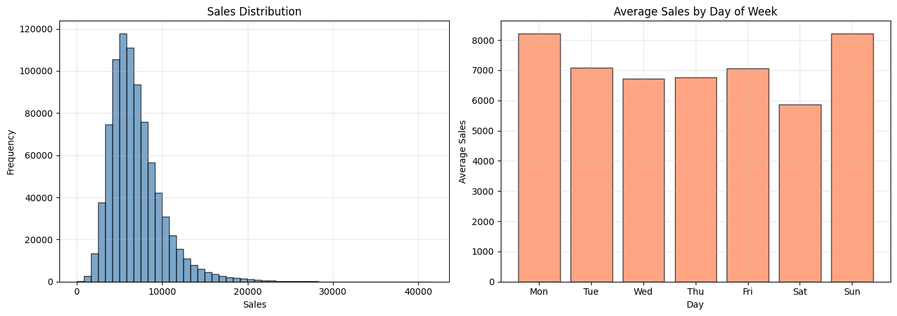
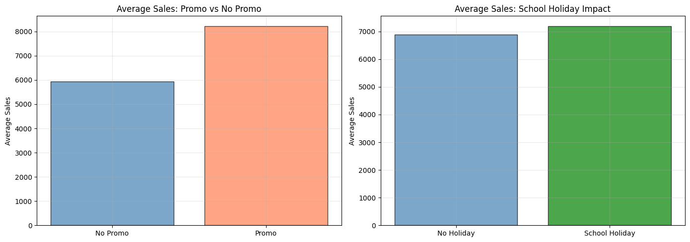
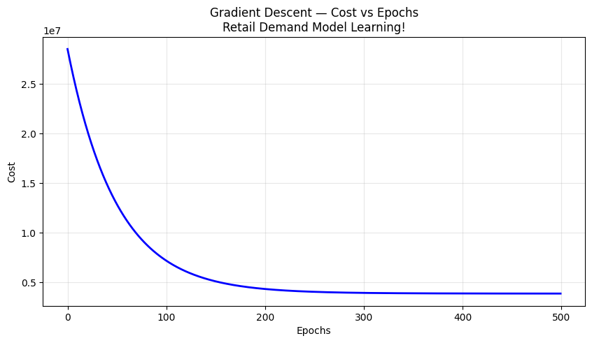
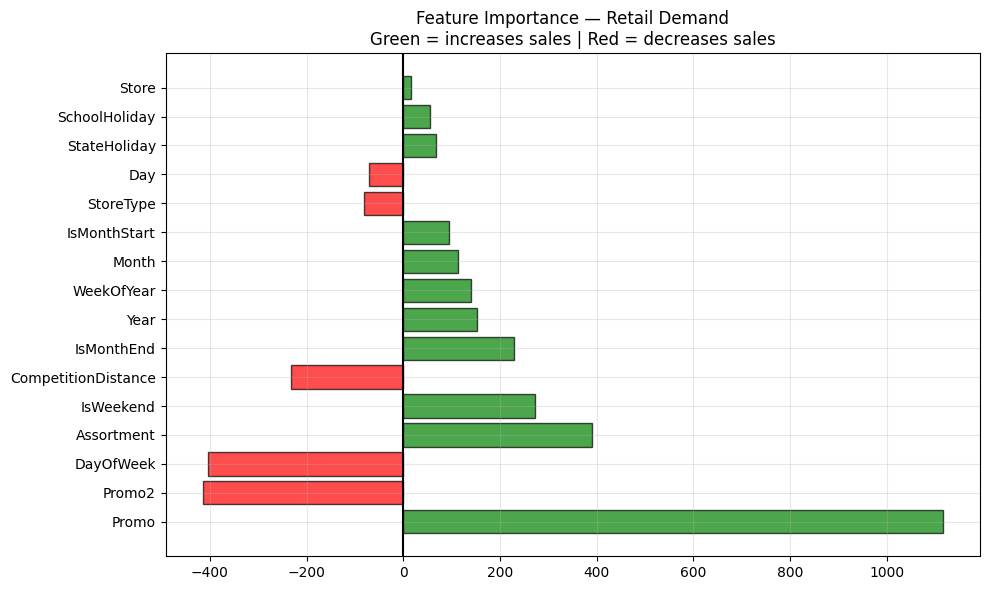
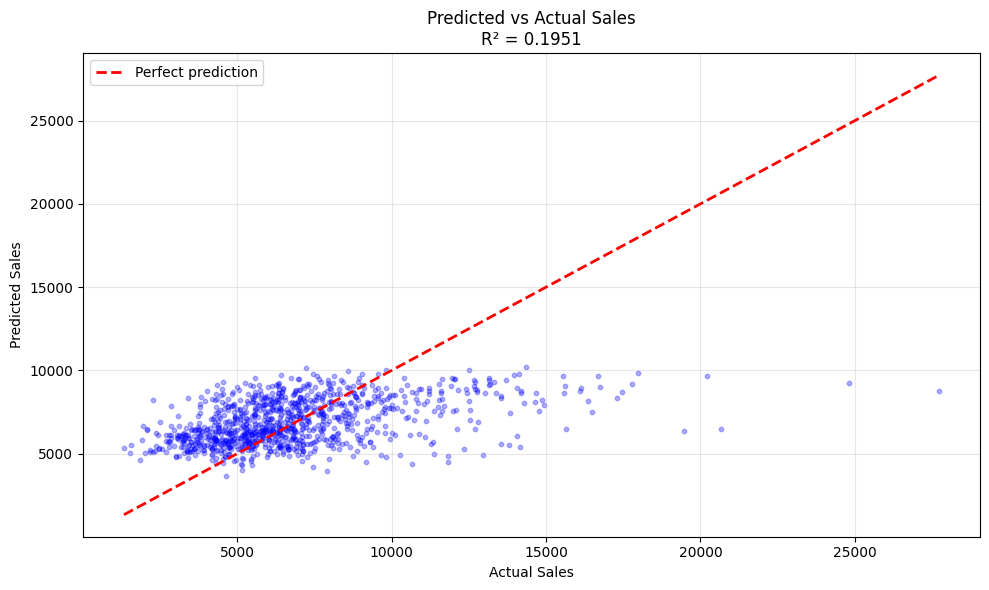

# 🛒 Retail Demand Prediction Engine

[]()
[]()
[](https://prajwal-retail-demand.streamlit.app)
[]()

> **Business Question:** "How much will this Rossmann store sell on a given day?"

## 🔗 Live Demo
**[🛒 Retail Demand Predictor — Live App](https://prajwal-retail-demand.streamlit.app)**

---

## 📋 Project Overview

Built a retail demand prediction system using Rossmann Store Sales data
from Kaggle. Implemented Linear Regression from NumPy scratch and compared
with sklearn Linear Regression — both achieved near-identical baseline results.

**This is a BASELINE model** — establishes the foundation for future improvements
with tree-based models and richer feature engineering.

---

## 📊 Key EDA Findings

- **Sales right-skewed** with outliers up to €41,551
- **DayOfWeek impacts sales** — Monday highest, Saturday lowest!
- **Promo has strong positive effect** — +€1,117 average daily boost
- **School holidays mildly boost sales** — families shop more!

---

## 💡 Business Insights Discovered

| Insight | Finding |
|---------|---------|
| 🎯 Promo impact | Special promotions → +€1,117 per day! |
| 📢 Promo2 effect | Lower coefficient in baseline model — promotional strategies may differ by store |
| 📅 Best day | Monday = highest sales in German retail |
| 🏫 School holiday | Higher sales — families shop together! |
| 🏪 Competition | Closer competitor = lower store sales |
| 💰 Month-end | Spending spike at month end (salary effect!) |
| 📈 Growth trend | Rossmann sales growing year on year! |

---

## 📊 Visualisations

### Sales Distribution & Weekly Demand Pattern


### Promotion Impact on Daily Revenue


### Gradient Descent — Model Learning Curve


### Feature Coefficients — What Drives Sales


### Predicted vs Actual Sales — Baseline Performance


---

## 🔬 Model Results

| Method | R² | RMSE |
|--------|-----|------|
| NumPy Scratch (Gradient Descent) | 0.1943 | €2,788 |
| sklearn Linear Regression | 0.1951 | €2,787 |

**Why R² = 0.19?**
This baseline linear model explains ~20% of sales variation
in a complex retail dataset. Retail demand involves non-linear
interactions between promotions, seasonality, store type, and
competition that linear regression cannot fully capture.
Future improvements may include tree-based models and richer features.

---

## 📁 Project Structure

```
09-retail-demand-prediction-engine/
├── data/                    ← gitignored (download from Kaggle!)
│   ├── train.csv            ← 844,338 rows
│   ├── store.csv            ← 1,115 stores
│   └── test.csv             ← Kaggle submission
├── notebooks/
│   └── retail_demand_prediction_engine.ipynb
├── models/
│   ├── model.pkl            ← trained Linear Regression
│   └── scaler.pkl           ← fitted StandardScaler
├── screenshots/
│   ├── sales_distribution.png
│   ├── promo_analysis.png
│   ├── cost_convergence.png
│   ├── feature_importance.png
│   └── predictions_vs_actual.png
├── app/
│   ├── app.py               ← Streamlit app
│   ├── model.pkl            ← deployment copy
│   ├── scaler.pkl           ← deployment copy
│   └── requirements.txt
├── .gitignore
└── README.md

models/  → training artifacts
app/     → deployment-ready copies for Streamlit hosting
```

---

## 🚀 How to Run

### Local
```bash
cd app/
pip install -r requirements.txt
streamlit run app.py
```

### Data Download
```
Dataset: kaggle.com/c/rossmann-store-sales
Download: train.csv, store.csv, test.csv
Place in: data/ folder
```

---

## 🛠️ Tech Stack

| Tool | Purpose |
|------|---------|
| Python | Core language |
| NumPy | Scratch implementation |
| Pandas | Data processing |
| sklearn | Model + scaling |
| Matplotlib | Visualizations |
| Streamlit | Web app |
| Pickle | Model serialization |

---

## 📈 Feature Importance

Top features driving sales predictions:
1. **Promo** → +€1,117 (strongest positive!)
2. **Assortment** → +€389 (wider range = more sales!)
3. **IsWeekend** → +€271 (weekend boost!)
4. **DayOfWeek** → -€415 (Monday best, later in week = lower)
5. **Promo2** → -€404 (lower coefficient in baseline model)

---

## 🎓 What I Learned

- **Feature engineering** from date columns (7 features from 1 date!)
- **Business logic** for missing values (CompetitionDistance → MAX not mean!)
- **Linear model limitations** — complex retail needs non-linear models
- **Baseline thinking** — establish benchmark before complex models
- **Model comparison** — Scratch and sklearn achieved near-identical baseline results
- **Data beats assumptions** — Monday highest sales, not Saturday!

---

## 👤 Author

**Prajwal Kondala**
B.Tech, IIT Kharagpur (Aerospace Engineering)
AI/ML Journey started February 2026

- GitHub: [@prajwal-kondala](https://github.com/prajwal-kondala)
- LinkedIn: [linkedin.com/in/prajwal-kondala](https://linkedin.com/in/prajwal-kondala)
- Live App: [Retail Demand Predictor](https://prajwal-retail-demand.streamlit.app)

---

## 📝 Project Details

- **Created:** April 2026
- **Dataset:** Rossmann Store Sales — Kaggle
- **Training rows:** 675,470
- **Test rows:** 168,868
- **Features:** 16
- **Project Type:** Portfolio Project #09 of 22
- **Phase:** 2 — Machine Learning

---

*Project 09 | Phase 2: Machine Learning*
*Baseline retail demand model with future upgrade potential.*
