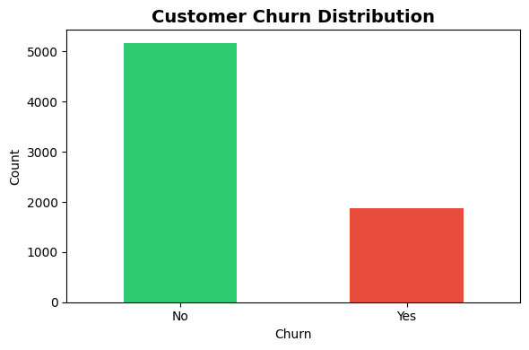
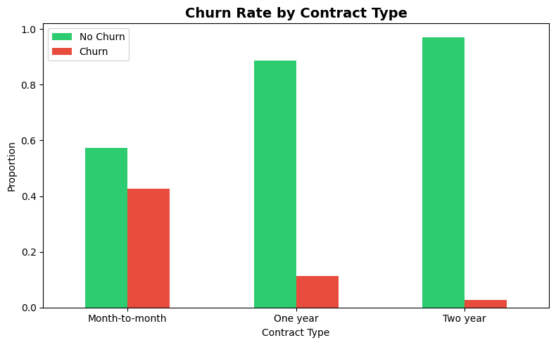
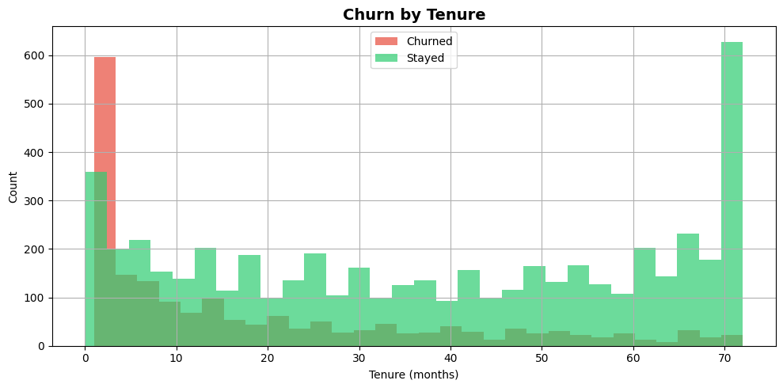
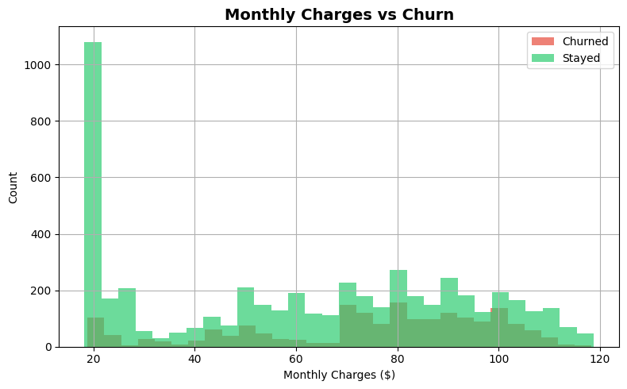
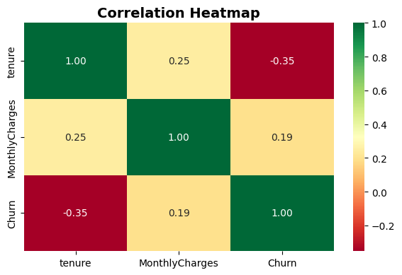
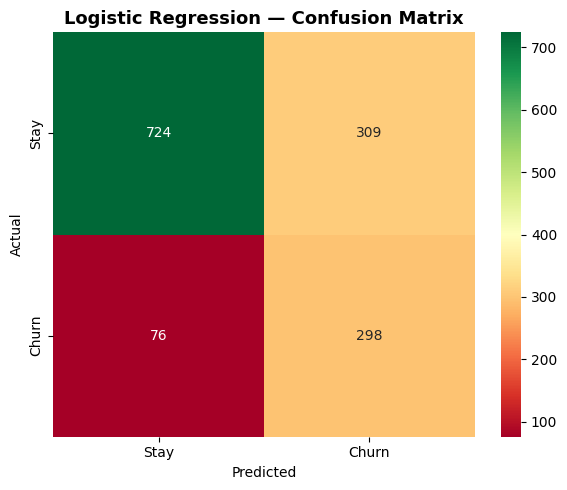
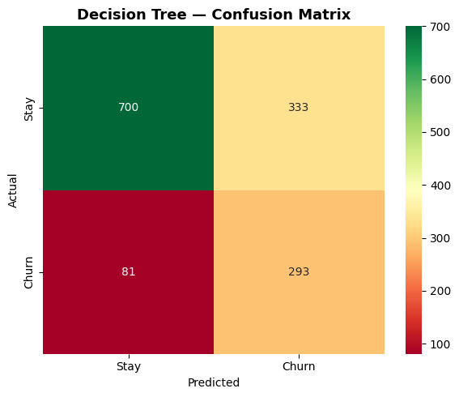
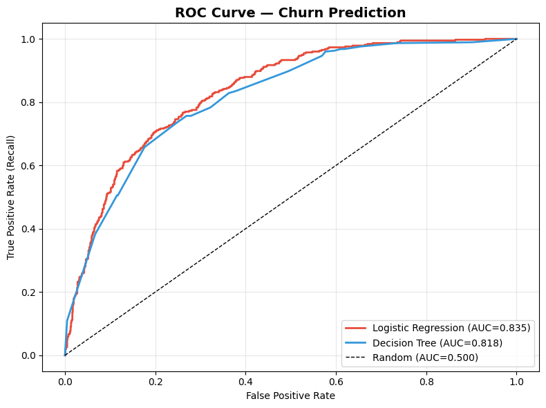
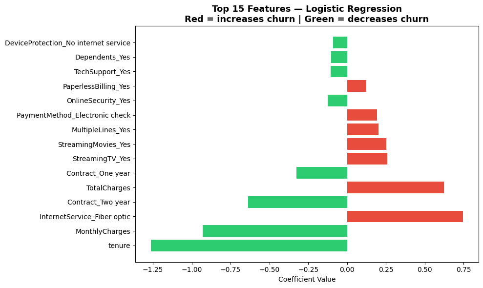
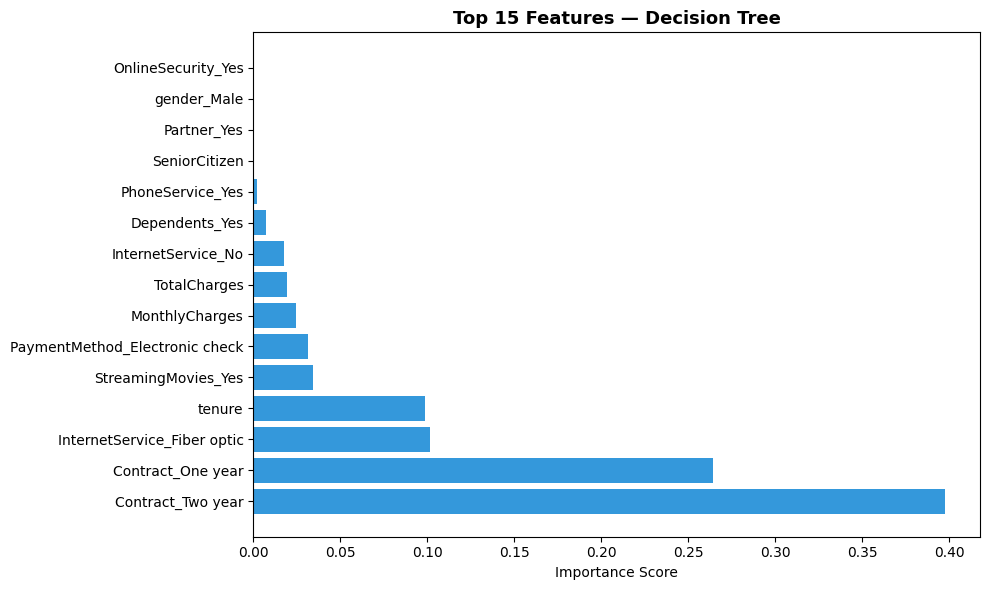

# 🔮 Customer Retention Intelligence System

[](https://python.org)
[](https://scikit-learn.org)
[](https://prajwal-customer-churn.streamlit.app)
[](https://www.kaggle.com/datasets/blastchar/telco-customer-churn)

> **Business Question:** "Which customers are at risk of leaving next month?"

## 🔗 Live Demo
**[🔮 Customer Retention Intelligence — Live App](https://prajwal-customer-churn.streamlit.app)**

---

## 📋 Project Overview

Built a customer churn prediction system using IBM Telco Customer Churn dataset.
Implemented and compared Logistic Regression and Decision Tree models — selected
Logistic Regression as primary model based on superior Recall score.

**Primary metric: Recall** — Missing a churner costs ₹5,000 in lost revenue.
A false alarm costs only ₹500. Catching churners is 10x more valuable than
avoiding false alarms.

**Threshold: 0.4** (recall-optimized, not default 0.5) — business-driven decision.

---

## 📊 Key EDA Findings

| Finding | Detail |
|---------|--------|
| 📋 Class Balance | 73.5% Stay, 26.5% Churn — manageable imbalance |
| 📄 Contract Type | Month-to-month customers → **43% churn rate!** |
| ⏱️ Tenure Effect | Low tenure (0-10 months) = danger zone for churn |
| 💰 Monthly Charges | Higher charges correlate with more churn |
| 📉 Correlation | tenure vs churn = **-0.35** (longer = loyal!) |

---

## 💡 Business Insights Discovered

| Insight | Finding |
|---------|---------|
| 📄 Contract type is the strongest driver of churn | Two-year contract customers show very low churn (~3%) |
| ⚡ Fiber optic risk | Fiber optic internet customers churn more |
| 🆕 New customer risk | First 10 months = highest churn probability |
| 💸 Price sensitivity | High monthly charges = more likely to leave |
| 🔒 Lock-in works | Annual contracts reduce churn by 14x vs monthly! |

---

## 📊 Visualisations

### Churn Distribution


### Churn by Contract Type


### Churn by Tenure


### Monthly Charges vs Churn


### Correlation Heatmap


### Confusion Matrix — Logistic Regression


### Confusion Matrix — Decision Tree


### ROC Curve — Both Models


### Feature Importance — Logistic Regression


### Feature Importance — Decision Tree


---

## 🔬 Model Results

| Method | Recall | Precision | F1 | AUC |
|--------|--------|-----------|-----|-----|
| **Logistic Regression** ✅ | **0.80** | 0.49 | 0.61 | **0.835** |
| Decision Tree | 0.78 | 0.47 | 0.59 | 0.8179 |

**Why Logistic Regression?**
Higher Recall — catches more churners at threshold=0.4.
Missing a churner costs ₹5,000. False alarm costs ₹500.
Logistic Regression consistently outperforms Decision Tree
on the metric that matters most for this business problem.

**Why Decision Tree trained WITHOUT scaling?**
Decision Trees split on feature value thresholds, not distances.
Feature scaling is not required — using raw features is more correct.

---

## 📊 Confusion Matrix Analysis

| Cell | Meaning | Business Impact |
|------|---------|----------------|
| TP = 298 | Churners correctly caught | ₹5,000 saved per customer! |
| TN = 724 | Stayers correctly identified | No action needed ✅ |
| FP = 309 | Non-churners flagged | ₹500 retention call cost |
| FN = 76 | Churners missed ← dangerous! | ₹5,000 lost revenue each! |

---

## 💰 Business Impact

```
At threshold = 0.4 (recall-optimized):

Churners caught  : 298 out of 374
Revenue saved    : ₹14,90,000 (298 × ₹5,000)
Retention cost   : ₹3,03,500  (607 calls × ₹500)
Net benefit      : ₹11,86,500

Churners missed  : 76
Revenue lost     : ₹3,80,000  (76 × ₹5,000)

Every percentage point of Recall improvement
= significant revenue impact at scale!
```

---

## 🎚️ Threshold Decision

```
Default threshold = 0.5 (common default)
Our threshold     = 0.4 (business-driven)

Why 0.4?
Missing churner  = ₹5,000 lost (10x more!)
False alarm      = ₹500 wasted

Lower threshold = catch more churners
even at cost of some false alarms!
This is the correct business decision! 🎯
```

---

## 📁 Project Structure

```
10-customer-retention-intelligence-system/
├── data/                    ← gitignored (download from Kaggle!)
│   └── WA_Fn-UseC_-Telco-Customer-Churn.csv
├── notebooks/
│   └── customer_retention_intelligence.ipynb
├── models/
│   ├── model.pkl            ← trained Logistic Regression
│   ├── scaler.pkl           ← fitted StandardScaler
│   └── feature_names.pkl   ← column order for alignment!
├── screenshots/
│   ├── churn_distribution.png
│   ├── churn_by_contract.png
│   ├── churn_by_tenure.png
│   ├── churn_by_charges.png
│   ├── correlation_heatmap.png
│   ├── cm_logistic.png
│   ├── cm_decision_tree.png
│   ├── roc_curve.png
│   ├── lr_feature_importance.png
│   └── dt_feature_importance.png
├── app/
│   ├── app.py               ← Streamlit app
│   ├── model.pkl            ← deployment copy
│   ├── scaler.pkl           ← deployment copy
│   ├── feature_names.pkl   ← deployment copy
│   └── requirements.txt
├── .gitignore
└── README.md

models/ → training artifacts
app/    → deployment-ready copies for Streamlit hosting
```

---

## 🚀 How to Run

### Local
```bash
cd app/
pip install -r requirements.txt
streamlit run app.py
```

### Data Download
```
Dataset: kaggle.com/datasets/blastchar/telco-customer-churn
File: WA_Fn-UseC_-Telco-Customer-Churn.csv
Place in: data/ folder
```

---

## 🛠️ Tech Stack

| Tool | Purpose |
|------|---------|
| Python | Core language |
| Pandas | Data processing |
| NumPy | Numerical operations |
| Matplotlib + Seaborn | Visualizations |
| sklearn | Models + scaling + metrics |
| Pickle | Model serialization |
| Streamlit | Web app + deployment |

---

## 📈 Feature Importance Findings

**Logistic Regression — Top Drivers:**
1. **tenure** → negative coefficient (longer = less churn!)
2. **MonthlyCharges** → positive (higher charges = more churn!)
3. **InternetService_Fiber optic** → positive (premium service risk!)
4. **Contract_Two year** → negative (lock-in reduces churn!)
5. **TotalCharges** → correlated with tenure

**Decision Tree — Top Drivers:**
1. **Contract_Two year** → importance 0.40 (strongest predictor!)
2. **Contract_One year** → importance 0.26
3. **InternetService_Fiber optic** → importance 0.10
4. **tenure** → importance 0.10
5. **StreamingMovies_Yes** → importance 0.03

**Both models agree:** Contract type and tenure are the
most important predictors of customer churn! 🎯

---

## 🎓 What I Learned

**Classification Concepts:**
- Classification vs Regression — fundamentally different output types
- Logistic Regression — sigmoid function + probability output
- Decision Trees — Gini impurity + information gain splits
- Confusion Matrix — TP, TN, FP, FN in business context
- Precision vs Recall tradeoff — business cost drives metric choice
- F1 Score — harmonic mean punishes weak performance
- ROC Curve + AUC — model performance across all thresholds
- Class imbalance — class_weight='balanced' handling
- Threshold optimization — 0.4 not 0.5 for recall focus

**Engineering Skills:**
- Feature encoding with pd.get_dummies()
- TotalCharges trap — object dtype fix with pd.to_numeric()
- stratify=y in train_test_split for imbalanced data
- Decision Trees do NOT need feature scaling
- feature_names.pkl for column alignment in deployment
- Dynamic confusion matrix extraction — no hardcoding!

**Business Thinking:**
- Recall > Precision for churn (asymmetric costs!)
- Threshold is a business decision not a technical default
- Contract type is single most actionable churn lever
- First 10 months = highest intervention opportunity
- Business impact quantified in ₹ not just percentages

---

## 👤 Author

**Prajwal Kondala**
B.Tech, IIT Kharagpur (Aerospace Engineering)
AI/ML Journey started February 2026

- GitHub: [@prajwal-kondala](https://github.com/prajwal-kondala)
- LinkedIn: [linkedin.com/in/prajwal-kondala](https://linkedin.com/in/prajwal-kondala)
- Live App: [Customer Retention Intelligence](https://prajwal-customer-churn.streamlit.app)

---

## 📝 Project Details

- **Created:** May 2026
- **Dataset:** IBM Telco Customer Churn — Kaggle
- **Training rows:** 7,032 (after cleaning)
- **Features:** 30 (after encoding)
- **Project Type:** Portfolio Project #10 of 22
- **Phase:** 2 — Machine Learning

---

*Project 10 | Phase 2: Machine Learning*
*Classification model with business-driven threshold optimization.*
