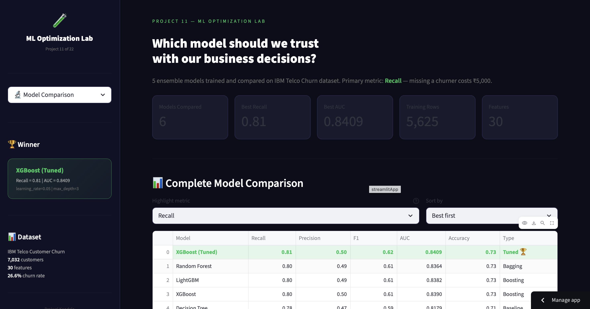
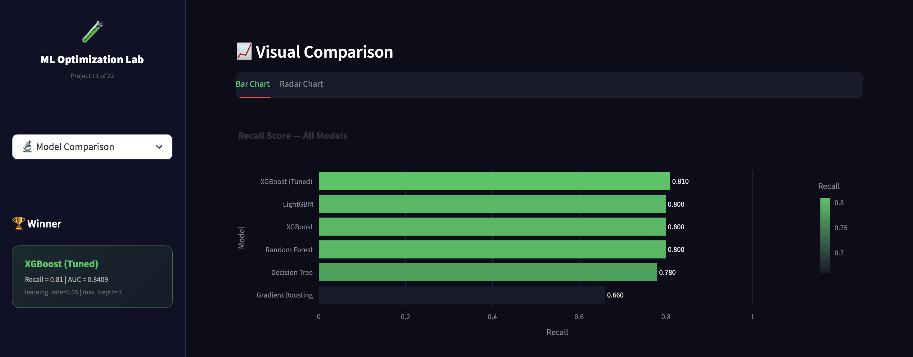
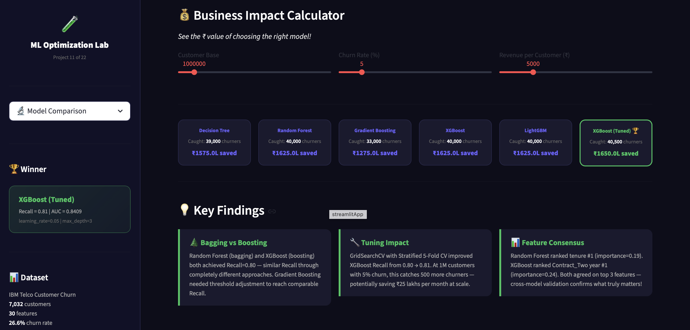
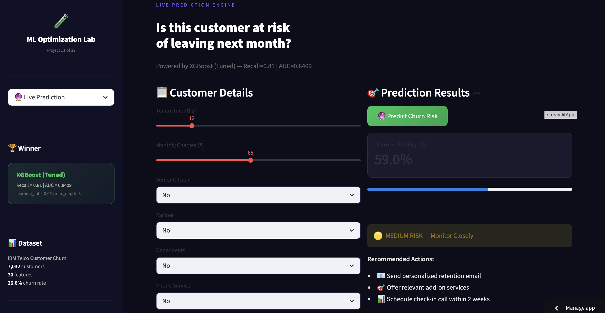
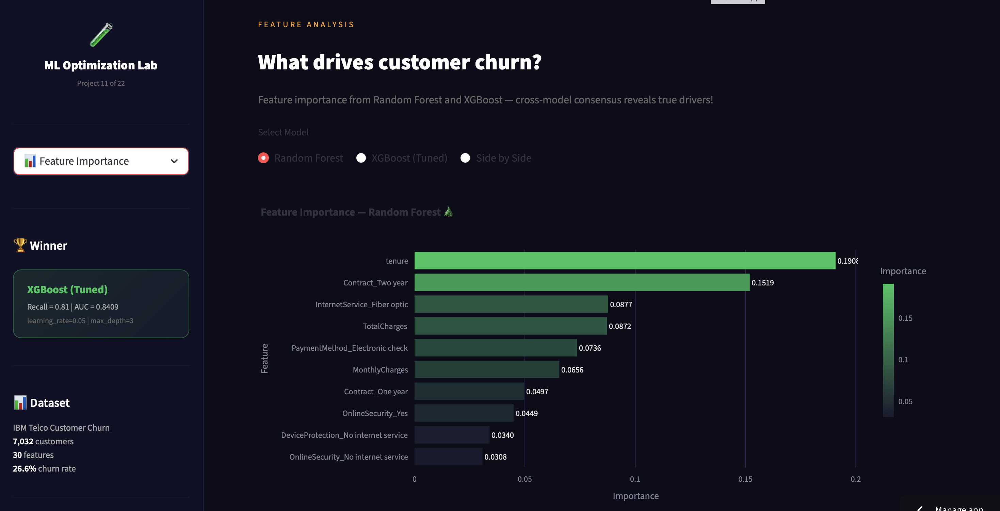
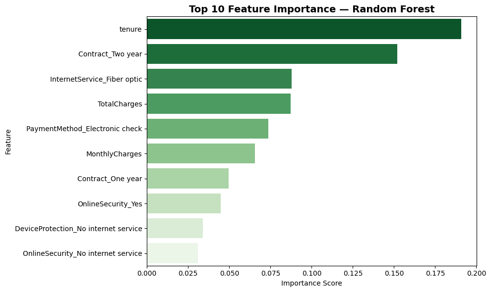
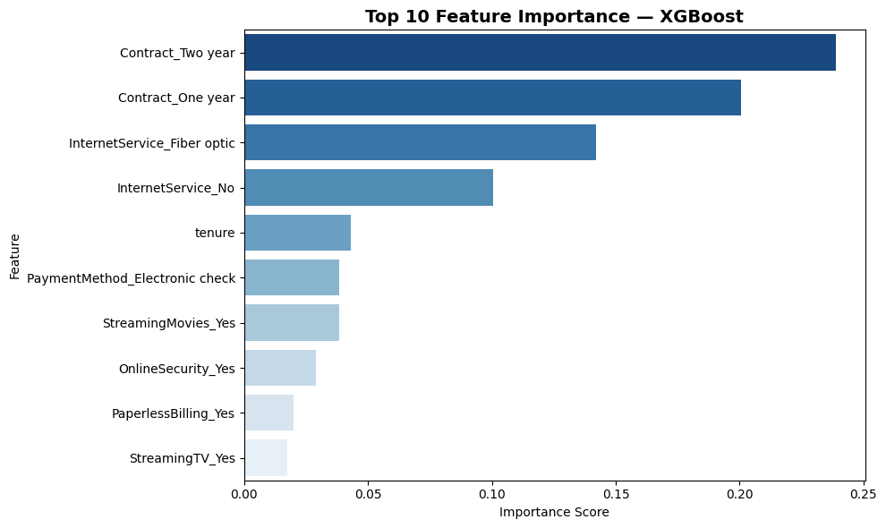

# 🧪 ML Optimization Lab

[]()
[]()
[]()
[](https://prajwal-ml-optimization-lab.streamlit.app)
[](https://www.kaggle.com/code/prajwalkondala/titanic-survival-prediction)

> **Business Question:** "Which model should we trust with our business decisions?"

## 🔗 Live Demo
**[🧪 ML Optimization Lab — Live App](https://prajwal-ml-optimization-lab.streamlit.app)**

---

## 📋 Project Overview

**Part A — ML Optimization Lab:**
Trained and compared 6 ML models on IBM Telco Customer Churn dataset.
XGBoost (Tuned) emerged as winner with Recall=0.81 and AUC=0.8409.
Built an interactive Streamlit dashboard for model comparison,
live prediction, and business impact calculation.

**Part B — Kaggle Competition:**
Applied ensemble skills to Titanic — Machine Learning from Disaster.
Achieved public leaderboard score of **0.76555** on first submission.

---

## 📊 Key EDA Findings

| Finding | Detail |
|---------|--------|
| 📋 Class Balance | 73.5% Stay, 26.5% Churn — manageable imbalance |
| 📄 Contract Type | Month-to-month customers → **43% churn rate** |
| ⏱️ Tenure Effect | Low tenure (0-10 months) = danger zone for churn |
| 💰 Monthly Charges | Higher charges correlate with more churn |
| 📉 Correlation | tenure vs churn = **-0.35** (longer = loyal) |
| ⚡ Fiber optic | Fiber internet customers show higher churn risk |
| 💳 Payment Method | Electronic check customers churn more than auto-pay |

---

## 💡 Business Insights Discovered

| Insight | Finding |
|---------|---------|
| 📄 Contract type is strongest churn driver | Two-year contract customers show very low churn (~3%) vs 43% month-to-month |
| ⚡ Fiber optic risk | Premium internet customers churn more — possibly due to high charges |
| 🆕 New customer risk | First 10 months = highest churn probability |
| 💸 Price sensitivity | High monthly charges = more likely to leave |
| 🔒 Lock-in works | Annual contracts reduce churn dramatically vs monthly |
| 💳 Auto-pay loyalty | Automatic payment customers stay longer than manual payers |

---

## 📊 Part A — Model Results

| Model | Recall | Precision | F1 | AUC | Type |
|-------|--------|-----------|-----|-----|------|
| Decision Tree | 0.78 | 0.47 | 0.59 | 0.8179 | Baseline |
| Random Forest | 0.80 | 0.49 | 0.61 | 0.8364 | Bagging |
| Gradient Boosting | 0.66 | 0.59 | 0.62 | 0.8407 | Boosting |
| XGBoost | 0.80 | 0.50 | 0.61 | 0.8390 | Boosting |
| LightGBM | 0.80 | 0.49 | 0.61 | 0.8382 | Boosting |
| **XGBoost (Tuned)** 🏆 | **0.81** | 0.50 | **0.62** | **0.8409** | Tuned |

**Primary metric: Recall** — Recall is especially important for churn prediction.
Missing a churner costs ₹5,000. A false alarm costs only ₹500.

### Why XGBoost performed best
```
Built-in regularization (γ + λ) → prevents overfitting
scale_pos_weight = 2.76         → handles class imbalance
Significantly faster than traditional Gradient Boosting implementations
Handles missing values automatically
```

---

## 🔧 Hyperparameter Tuning

```
Method  : GridSearchCV + Stratified 5-Fold CV
Grid    : n_estimators=[100,200], max_depth=[3,5],
          learning_rate=[0.05,0.1]
Total   : 40 training runs (8 combinations × 5 folds)
Scoring : Recall — business metric

Best params → learning_rate=0.05, max_depth=3
Recall improved: 0.80 → 0.81
At 1M customers: potentially ₹25L more saved per month at scale.
```

Test set should remain untouched until final evaluation to avoid leakage. 🔒

---

## 📈 Feature Importance — Cross Model Consensus

**Random Forest — Top Features:**
| Rank | Feature | Importance |
|------|---------|-----------|
| 1 | tenure | 0.1908 |
| 2 | Contract_Two year | 0.1519 |
| 3 | InternetService_Fiber optic | 0.0877 |
| 4 | TotalCharges | 0.0872 |
| 5 | PaymentMethod_Electronic check | 0.0736 |

**XGBoost — Top Features:**
| Rank | Feature | Importance |
|------|---------|-----------|
| 1 | Contract_Two year | 0.2388 |
| 2 | Contract_One year | 0.2005 |
| 3 | InternetService_Fiber optic | 0.1422 |
| 4 | InternetService_No | 0.1006 |
| 5 | tenure | 0.0432 |

RF ranks tenure #1. XGBoost ranks Contract_Two year #1.
Both agree on top 3 features — cross-model agreement strengthens confidence in key business drivers. 🎯

---

## 💰 Business Impact

```
At 1M customers, 5% churn rate, ₹5,000 per churner:

Model              Churners Caught    ₹ Saved
─────────────────────────────────────────────
Decision Tree      39,000             ₹1,575L
Random Forest      40,000             ₹1,625L
Gradient Boosting  33,000             ₹1,275L
XGBoost            40,000             ₹1,625L
LightGBM           40,000             ₹1,625L
XGBoost (Tuned)    40,500             ₹1,650L ← Winner

Tuning impact:
500 more churners caught →
potentially ₹25L more saved per month at scale.
```

---

## 📊 Visualisations

### Model Comparison Dashboard


### Visual Comparison — All Models


### Business Impact Calculator


### Live Prediction Engine


### Feature Importance Analysis


### Random Forest — Top Features


### XGBoost — Top Features


---

## 🚢 Part B — Titanic Kaggle Competition

### Results
```
Public Leaderboard Score : 0.76555
Leaderboard Rank         : #10,249
Model                    : XGBoost (CV Score: 0.8216)
Features                 : 7 engineered features
Key finding              : Sex emerged as the strongest
                           survival predictor in the dataset. 🚢
```

### Model Comparison — Titanic

| Model | Val Accuracy | CV Score |
|-------|-------------|----------|
| Logistic Regression | 0.7933 | 0.7913 |
| Decision Tree | 0.7598 | 0.8171 |
| Random Forest | 0.8101 | 0.8036 |
| **XGBoost** 🏆 | 0.7933 | **0.8216** |

**Why CV Score over Val Accuracy?**
CV Score averages 5 different splits — more reliable than one lucky split.
XGBoost won on CV Score → strongest generalization estimate.

### Feature Engineering — Titanic
```
Original  : Pclass, Sex, Age, Fare, Embarked
Engineered: FamilySize (SibSp + Parch + 1)
            IsAlone (FamilySize == 1)
Missing   : Age → median | Embarked → mode
Total     : 7 features
```

### [📓 Public Kaggle Notebook](https://www.kaggle.com/code/prajwalkondala/titanic-survival-prediction)

---

## 📁 Project Structure

```
11-ml-optimization-lab/
├── app/
│   ├── app.py                ← Streamlit dashboard (3 pages)
│   ├── requirements.txt
│   ├── best_xgb_model.pkl   ← tuned XGBoost
│   ├── dt_model.pkl
│   ├── rf_model.pkl
│   ├── gb_model.pkl
│   ├── xgb_model.pkl
│   ├── lgbm_model.pkl
│   └── feature_names.pkl    ← column alignment
├── notebooks/
│   ├── ensemble_methods.ipynb    ← Part A exploration
│   └── titanic_kaggle.ipynb      ← Part B Kaggle
├── screenshots/
│   ├── model_comparison.png
│   ├── model_comparison_chart.png
│   ├── business_impact.png
│   ├── live_prediction.png
│   ├── feature_importance.png
│   ├── rf_feature_importance.png
│   └── xgb_feature_importance.png
├── models/                   ← gitignored (local only)
├── data/                     ← gitignored
├── .gitignore
└── README.md
```

---

## 🛠️ Tech Stack

| Tool | Purpose |
|------|---------|
| Python | Core language |
| Pandas | Data processing |
| NumPy | Numerical operations |
| Scikit-learn | Models + CV + metrics |
| XGBoost | Primary winning model |
| LightGBM | Comparison model |
| Plotly | Interactive charts |
| Streamlit | Web app + deployment |
| Pickle | Model serialization |

---

## 🎓 What I Learned

**Ensemble Concepts:**
- Bagging (Random Forest) reduces variance via independent trees and majority vote
- Boosting (XGBoost, LightGBM) reduces bias via sequential residual correction
- XGBoost regularization (γ + λ) follows same penalty philosophy as Log Loss
- GridSearchCV + Stratified K-Fold enables hyperparameter tuning without data leakage
- scale_pos_weight handles class imbalance natively in XGBoost
- Where multiple algorithms agree often indicates stronger underlying signal

**Engineering Skills:**
- Saving 6 models + feature_names.pkl for multi-model Streamlit deployment
- Plotly radar chart for multi-metric model comparison
- Business impact calculator with dynamic sliders
- All-models-vote visualization in live prediction
- Kaggle submission pipeline — feature engineering + CV + submission.csv

**Business Thinking:**
- Recall is especially important for churn prediction — asymmetric cost structure
- Small Recall improvement (0.80→0.81) at scale can mean significant revenue impact
- No single model wins on all metrics — business context determines priority
- Feature importance varies by algorithm — consensus across models is more reliable
- CV Score provides more reliable generalization estimate than single validation split

---

## 👤 Author

**Prajwal Kondala**
B.Tech, IIT Kharagpur (Aerospace Engineering)
AI/ML Journey started February 2026

- GitHub: [@prajwal-kondala](https://github.com/prajwal-kondala)
- LinkedIn: [linkedin.com/in/prajwal-kondala](https://linkedin.com/in/prajwal-kondala)
- Live App: [ML Optimization Lab](https://prajwal-ml-optimization-lab.streamlit.app)
- Kaggle: [prajwalkondala](https://www.kaggle.com/prajwalkondala)

---

## 📝 Project Details

- **Created:** May 2026
- **Dataset A:** IBM Telco Customer Churn — Kaggle (7,032 rows, 30 features)
- **Dataset B:** Titanic — Kaggle Competition (891 train, 418 test)
- **Project Type:** Portfolio Project #11 of 22
- **Phase:** 2 — Machine Learning

---

*Project 11 | Phase 2: Machine Learning*
*ML Optimization Lab — 6 model comparison + Kaggle leaderboard entry.*
