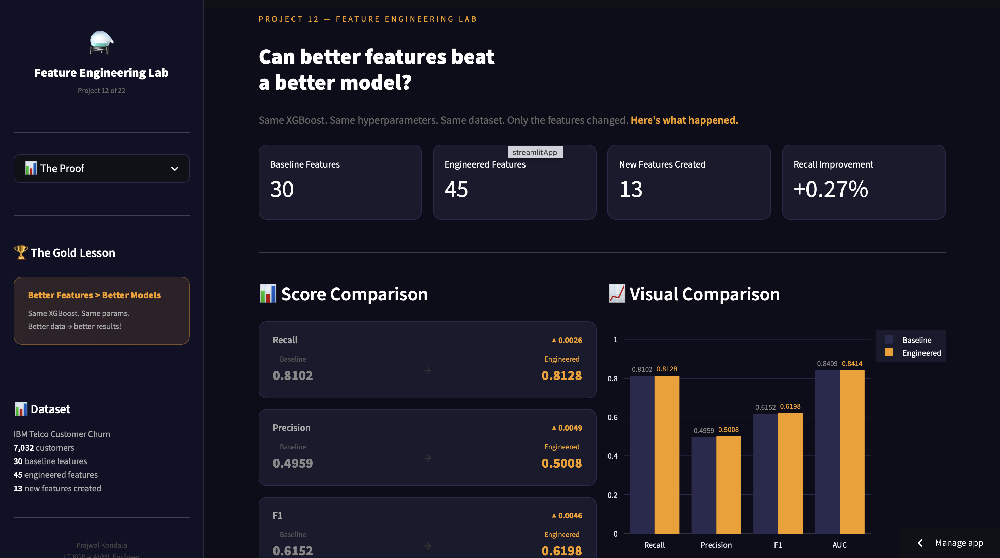
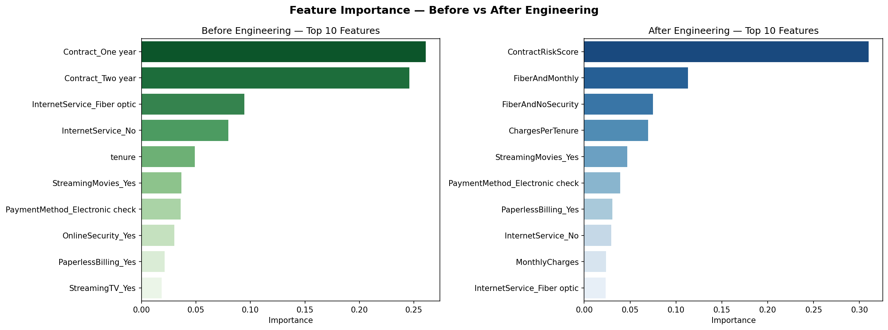
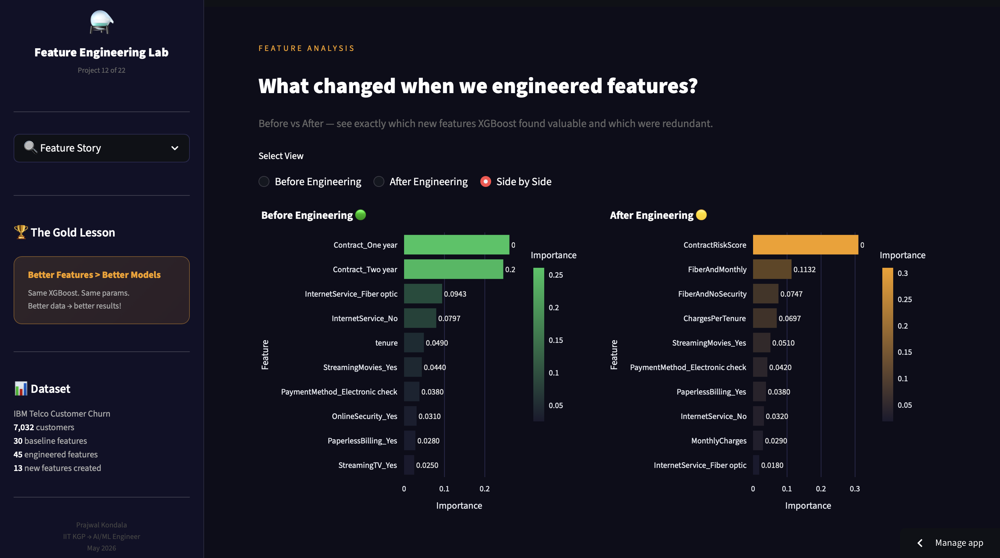
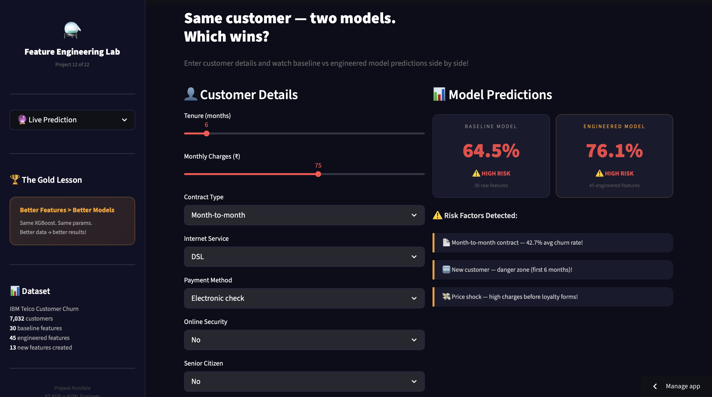
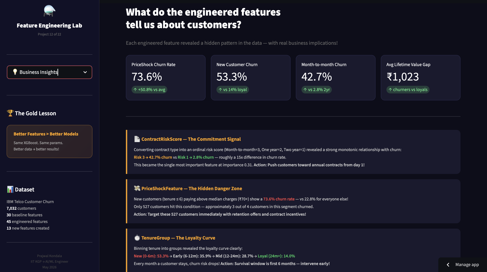
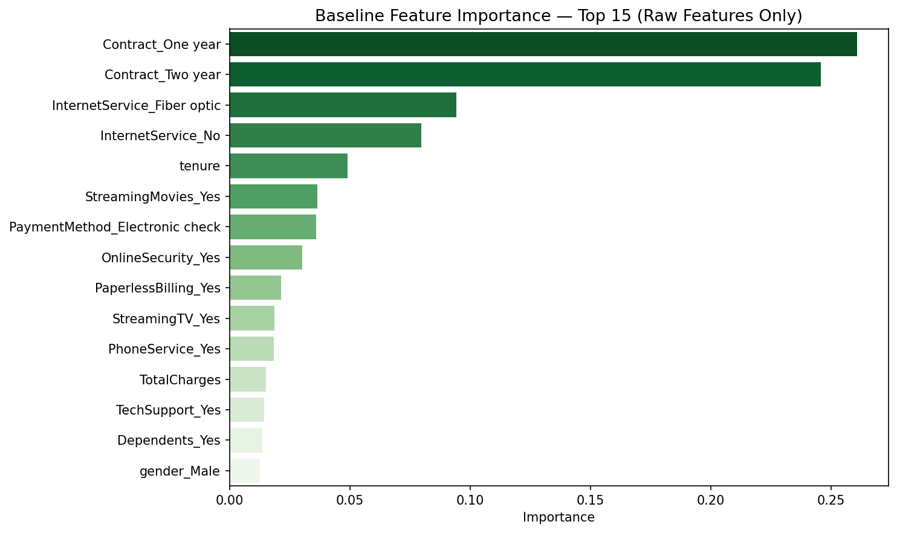

# ⚗️ Feature Engineering Performance Lab

[]()
[]()
[](https://prajwal-feature-engineering-lab.streamlit.app)
[]()

> **Business Question:** "Can better features sometimes outperform algorithm changes alone?"

## 🔗 Live Demo
**[⚗️ Feature Engineering Performance Lab — Live App](https://prajwal-feature-engineering-lab.streamlit.app)**

---

## 📋 Project Overview

Designed a controlled experiment to measure the impact of feature engineering
on model performance. Using IBM Telco Customer Churn data, the same XGBoost model
was trained twice — once on 30 raw features and once on 45 engineered features —
with identical hyperparameters throughout.

The result: all 4 evaluation metrics improved modestly but consistently,
demonstrating that thoughtful feature engineering can sometimes outperform
algorithm changes alone.

**13 new features were engineered** using domain knowledge, ratio strategies,
interaction logic, and behavioral insights — with ContractRiskScore
emerging as the single most important feature at importance 0.31.

---

## 📊 Key EDA Findings

| Finding | Detail |
|---------|--------|
| 📋 Class Balance | 73.5% Stay, 26.5% Churn |
| 📄 Contract Risk | Month-to-month → 42.7% churn vs Two year → 2.8% |
| ⏱️ Tenure Effect | New customers (0-6m) → 53.3% churn vs Loyal (24m+) → 14.0% |
| 💸 Price Shock | New customers paying above median charges → 73.6% churn rate |
| 💰 Lifetime Value | Non-churners avg ₹2,555 vs Churners avg ₹1,532 — 1.7x gap |
| ⚡ Fiber Risk | Fiber optic + month-to-month = one of strongest churn-risk combinations |
| 💳 Payment Signal | Electronic check customers show higher churn than auto-pay |

---

## 💡 Business Insights Discovered

| Insight | Finding |
|---------|---------|
| 📄 Contract commitment | Roughly a 15x difference in churn rate between month-to-month and two-year customers |
| 💸 Price shock danger | 527 customers — new + high charges — show 73.6% churn rate |
| ⏱️ First 6 months critical | Early retention intervention appears especially important within the first 6 months |
| 💰 Lifetime value gap | Churners leave before accumulating value — prioritize proactive retention for high-value customers |
| 🔒 Auto-pay loyalty | Automatic payment customers show stronger retention signal |
| ⚡ Fiber + monthly risk | Premium service + no commitment = highest-risk customer profile |

---

## 🔬 The Experiment — Controlled Comparison

```
Same XGBoost. Same hyperparameters. Same dataset.
Only the features changed.

Baseline  → 30 raw features   (standard preprocessing only)
Engineered → 45 features      (30 raw + 13 new engineered features)

learning_rate    = 0.05
max_depth        = 3
n_estimators     = 100
scale_pos_weight = 2.76
random_state     = 42
```

---

## 📊 Model Results

| Metric | Baseline | Engineered | Improvement |
|--------|----------|------------|-------------|
| **Recall** | 0.8102 | **0.8128** | ▲ +0.0026 |
| **Precision** | 0.4959 | **0.5008** | ▲ +0.0049 |
| **F1** | 0.6152 | **0.6198** | ▲ +0.0046 |
| **AUC** | 0.8409 | **0.8414** | ▲ +0.0005 |

**Primary metric: Recall** — missing a churner costs ₹5,000 vs ₹500 for a false alarm.
All 4 metrics improved modestly but consistently with engineered features.

---

## ⚙️ Feature Engineering — 13 New Features

### Ratio Features
```
ChargesPerTenure  = MonthlyCharges / (tenure + 1)
TotalToMonthly    = TotalCharges / (MonthlyCharges + 1)
```
Ratio features expose risk patterns that raw columns hide individually.
A new customer paying ₹90/month looks different from a loyal customer paying the same — the ratio captures this!

### Domain Features
```
IsNewCustomer      = (tenure <= 6)
IsLongTermCustomer = (tenure >= 24)
IsAutoPayment      = payment method in [credit card, bank transfer]
ServiceCount       = count of active add-on services
```
Domain knowledge translated directly into model-readable signals.

### Interaction Features
```
FiberAndMonthly    = Fiber optic AND Month-to-month
FiberAndNoSecurity = Fiber optic AND No online security
NewAndMonthly      = tenure <= 6 AND Month-to-month
```
Combinations that reveal risk profiles neither feature captures alone.

### Binning Feature
```
TenureGroup = New (0-6m) / Early (6-12m) / Mid (12-24m) / Loyal (24m+)
```
Captures the non-linear loyalty curve that raw tenure misses.

### Behavioral Features (Domain-Driven)
```
ContractRiskScore   = Month-to-month→3, One year→2, Two year→1
LifetimeValueApprox = MonthlyCharges × tenure
PriceShockFeature   = MonthlyCharges > median AND tenure <= 6
```
These features came from business intuition — not just mathematical creativity.

---

## 📈 Feature Importance — What XGBoost Found

### Before Engineering — Top 5
| Rank | Feature | Importance |
|------|---------|-----------|
| 1 | Contract_One year | 0.2609 |
| 2 | Contract_Two year | 0.2457 |
| 3 | InternetService_Fiber optic | 0.0943 |
| 4 | InternetService_No | 0.0797 |
| 5 | tenure | 0.0490 |

### After Engineering — Top 5
| Rank | Feature | Importance |
|------|---------|-----------|
| 1 | **ContractRiskScore** | **0.3098** |
| 2 | FiberAndMonthly | 0.1132 |
| 3 | FiberAndNoSecurity | 0.0747 |
| 4 | ChargesPerTenure | 0.0697 |
| 5 | StreamingMovies_Yes | 0.0510 |

**Key shift:** Both raw contract columns consolidated into one ContractRiskScore at importance 0.31.
The underlying signal became more directly learnable after feature engineering!

### What XGBoost Ignored
```
IsAutoPayment, IsNewCustomer, IsLongTermCustomer,
TenureGroup groups, PriceShockFeature → importance = 0.000

Reason: XGBoost already captures these patterns
        from tenure, contract, and payment columns directly.
        Redundant features add noise, not signal.
```
Key lesson: A feature can be statistically powerful but still redundant
if the model already captures that information through other features!

---

## 📊 Visualisations

### The Proof — Baseline vs Engineered


### Feature Importance — Before vs After Engineering


### Feature Story — Side by Side


### Live Prediction — Both Models Side by Side


### Business Insights


### Baseline Feature Importance


---

## 📁 Project Structure

```
12-feature-engineering-lab/
├── notebooks/
│   ├── 01_baseline.ipynb           ← baseline model + locked scores
│   ├── 02_feature_engineering.ipynb ← all 13 features created + validated
│   └── 03_comparison.ipynb         ← proof — baseline vs engineered
├── app/
│   ├── app.py                      ← Streamlit app (4 pages)
│   ├── baseline_model.pkl          ← trained baseline XGBoost
│   ├── engineered_model.pkl        ← trained engineered XGBoost
│   ├── baseline_features.pkl       ← column alignment
│   ├── engineered_features.pkl     ← column alignment
│   └── requirements.txt
├── screenshots/
│   ├── the_proof.png
│   ├── feature_importance_comparison.png
│   ├── feature_story.png
│   ├── live_prediction.png
│   ├── business_insights.png
│   └── baseline_feature_importance.png
├── data/                           ← gitignored (download from Kaggle!)
├── models/                         ← gitignored (local training artifacts)
├── .gitignore
└── README.md
```

---

## 🚀 How to Run

### Local
```bash
cd app/
pip install -r requirements.txt
streamlit run app.py
```

### Data Download
```
Dataset: IBM Telco Customer Churn
Source : kaggle.com/datasets/blastchar/telco-customer-churn
Place  : data/ folder
```

---

## 🛠️ Tech Stack

| Tool | Purpose |
|------|---------|
| Python | Core language |
| Pandas | Data processing |
| NumPy | Numerical operations |
| Scikit-learn | Train/test split + metrics |
| XGBoost | Primary model (both versions!) |
| Matplotlib / Seaborn | Notebook visualizations |
| Plotly | Interactive app charts |
| Streamlit | Web app + deployment |
| Pickle | Model serialization |

---

## 🎓 What I Learned

**Feature Engineering Principles:**
- Engineer first, encode after — raw column values needed for domain features
- Defensive coding: tenure+1 in division prevents zero-division errors
- Ratio features reveal patterns that individual columns hide
- Interaction features capture risk profiles no single feature can express
- Binning can help expose certain non-linear relationships more clearly

**What XGBoost Taught Us:**
- A feature can have 73.6% churn rate signal but still be redundant
- ContractRiskScore consolidated scattered contract columns into one powerful signal
- Zero-importance features confirm redundancy — not failure of the idea
- Strong tree ensembles already learn many interactions internally
- Best engineered features are behaviorally meaningful, not just mathematically creative

**Business Thinking:**
- Feature engineering is business understanding translated into math
- ContractRiskScore came from understanding that commitment = loyalty
- PriceShockFeature came from knowing high prices hurt before loyalty forms
- Small metric improvements at scale translate to significant business impact
- Recall is especially important for churn — asymmetric cost structure drives metric choice

---

## 👤 Author

**Prajwal Kondala**
B.Tech, IIT Kharagpur (Aerospace Engineering)
AI/ML Journey started February 2026

- GitHub: [@prajwal-kondala](https://github.com/prajwal-kondala)
- LinkedIn: [linkedin.com/in/prajwal-kondala](https://linkedin.com/in/prajwal-kondala)
- Live App: [Feature Engineering Lab](https://prajwal-feature-engineering-lab.streamlit.app)

---

## 📝 Project Details

- **Created:** May 2026
- **Dataset:** IBM Telco Customer Churn — Kaggle (7,032 rows, 21 columns)
- **Baseline Features:** 30
- **Engineered Features:** 45
- **New Features Created:** 13
- **Project Type:** Portfolio Project #12 of 22
- **Phase:** 2 — Machine Learning

---

*Project 12 | Phase 2: Machine Learning*
*Feature Engineering Performance Lab — proving that better features can outperform algorithm changes alone.*
