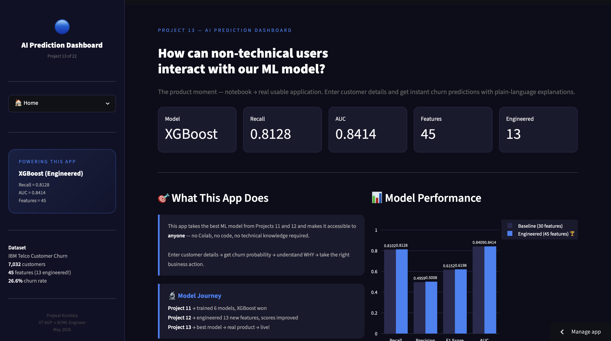
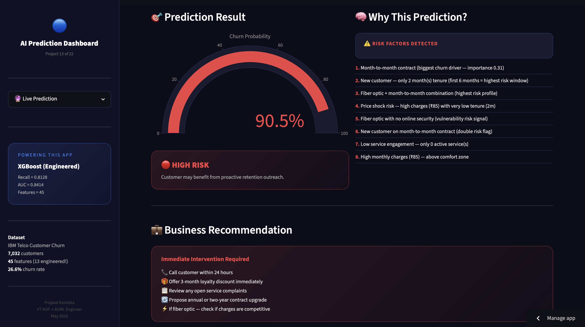
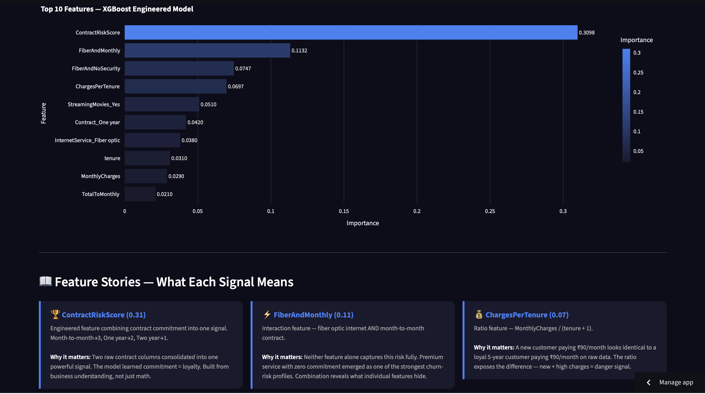
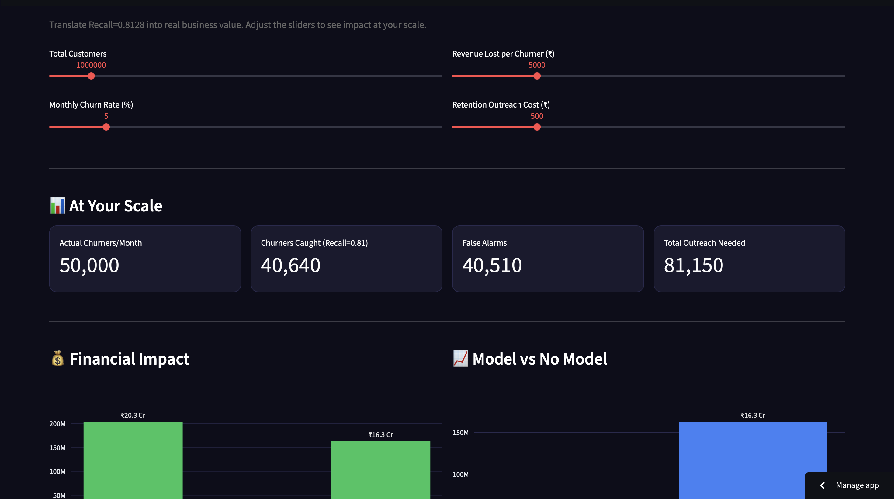

# 🔵 AI Powered Prediction Dashboard

[]()
[]()
[](https://prajwal-ai-prediction-dashboard.streamlit.app)
[]()

> **Business Question:** "How can non-technical users interact with our ML model?"

## 🔗 Live Demo
**[🔵 AI Powered Prediction Dashboard — Live App](https://prajwal-ai-prediction-dashboard.streamlit.app)**

---

## 📋 Project Overview

The transition from notebook experimentation to a usable ML application.

This project takes the best ML model from Projects 11 and 12 — XGBoost trained on
45 engineered features — and makes it accessible to anyone. No Colab, no code,
no technical knowledge required. Enter customer details, get churn probability,
understand WHY, and take the right business action.

**Model powering this app:** XGBoost (Engineered) — Recall=0.8128, AUC=0.8414, 45 features (13 engineered)

**Key upgrade over Projects 11 and 12:** Natural language explanation engine —
not just a probability number, but a plain-English explanation of which specific
risk factors drove the prediction for that individual customer.

---

## 📊 Key EDA Findings

| Finding | Detail |
|---------|--------|
| 📄 Contract Risk | Month-to-month → 42.7% churn vs Two year → 2.8% churn — roughly 15x difference |
| ⏱️ Tenure Effect | New customers (0–6m) → 53.3% churn vs Loyal (24m+) → 14.0% churn |
| 💸 Price Shock | New customer + high charges → 73.6% churn rate (527 customers in this profile) |
| 💰 Lifetime Value | Non-churners avg ₹2,555 vs Churners avg ₹1,532 — 1.7x gap |
| ⚡ Fiber Risk | Fiber optic + month-to-month = one of strongest churn-risk combinations |
| 💳 Payment Signal | Electronic check customers show higher churn than auto-pay customers |

---

## 💡 Business Insights

| Insight | Finding |
|---------|---------|
| 📄 Contract commitment | Roughly a 15x difference in churn rate between month-to-month and two-year customers |
| ⏱️ First 6 months critical | Early retention intervention appears especially important within the first 6 months |
| 💸 Price shock danger | New customers paying above median charges show 73.6% churn rate |
| 💰 Lifetime value gap | Churners leave before accumulating value — prioritize proactive retention for high-value customers |
| 🔒 Auto-pay loyalty | Automatic payment customers show stronger retention signal |
| ⚡ Fiber + monthly risk | Premium service with zero commitment emerged as one of the strongest churn-risk profiles |

---

## 📈 Model Performance — Baseline vs Engineered

| Metric | Baseline (30 features) | Engineered (45 features) | Improvement |
|--------|----------------------|--------------------------|-------------|
| **Recall** | 0.8102 | **0.8128** | ▲ +0.0026 |
| **Precision** | 0.4959 | **0.5008** | ▲ +0.0049 |
| **F1** | 0.6152 | **0.6198** | ▲ +0.0046 |
| **AUC** | 0.8409 | **0.8414** | ▲ +0.0005 |

**Primary metric: Recall** — missing a churner costs ₹5,000 vs ₹500 for a false alarm.
All 4 metrics improved modestly but consistently with engineered features.

**Model journey:**
```
Project 11 → trained 6 models, XGBoost won (Recall=0.81, AUC=0.8409)
Project 12 → engineered 13 new features, all metrics improved
Project 13 → best model → real product → live!
```

---

## 🧠 Natural Language Explanation Engine

The key upgrade in Project 13 — the app doesn't just output a probability.
It detects which specific risk signals are active for that customer and
explains the prediction in plain English.

**Example — High Risk Customer:**
```
Risk Factors Detected:
1. Month-to-month contract (biggest churn driver — importance 0.31)
2. New customer — only 2 month(s) tenure (first 6 months = highest risk window)
3. Fiber optic + month-to-month combination (highest risk profile)
4. Price shock risk — high charges (₹85) with very low tenure (2m)
5. New customer on month-to-month contract (double risk flag)
```

**Example — Low Risk Customer:**
```
Positive Signals:
1. Two-year contract (strong loyalty signal)
2. Long-term customer — 58 months tenure (loyalty established)
3. Auto-payment method (loyalty and commitment signal)
4. High service engagement — 5 active services (switching costs high)
```

This is what makes an ML product useful — not just a number, but an explanation a business manager can act on.

---

## 📊 Feature Importance — Top 10

| Rank | Feature | Importance | Type |
|------|---------|-----------|------|
| 1 | **ContractRiskScore** | **0.3098** | Engineered — behavioral |
| 2 | FiberAndMonthly | 0.1132 | Engineered — interaction |
| 3 | FiberAndNoSecurity | 0.0747 | Engineered — interaction |
| 4 | ChargesPerTenure | 0.0697 | Engineered — ratio |
| 5 | StreamingMovies_Yes | 0.0510 | Raw — one-hot |
| 6 | Contract_One year | 0.0420 | Raw — one-hot |
| 7 | InternetService_Fiber optic | 0.0380 | Raw — one-hot |
| 8 | tenure | 0.0310 | Raw — numeric |
| 9 | MonthlyCharges | 0.0290 | Raw — numeric |
| 10 | TotalToMonthly | 0.0210 | Engineered — ratio |

**Key shift from Project 11:** ContractRiskScore (engineered) consolidated both raw contract
columns into one signal at importance 0.31. The underlying pattern became more directly
learnable after feature engineering.

---

## 💰 Business Impact

```
At 1M customers, 5% monthly churn rate, ₹5,000 per churner:

Metric                    Value
──────────────────────────────────────────
Actual churners/month     50,000
Churners caught           40,640  (Recall=0.8128)
Total outreach needed     81,150
Revenue protected         ₹20.3 Cr/month
Outreach cost             ₹4.1 Cr/month
Net benefit               ₹16.3 Cr/month

Small Recall improvement (0.8102 → 0.8128) at scale
translates to significant business impact.
```

---

## 📊 Visualisations

### Home — App Overview


### Live Prediction — Gauge + Explanation Engine


### Model Insights — Feature Importance


### Business Impact Calculator


---

## 📁 Project Structure

```
13-ai-prediction-dashboard/
├── app/
│   ├── app.py                    ← Streamlit app (4 pages)
│   ├── engineered_model.pkl      ← XGBoost trained on 45 features
│   ├── engineered_features.pkl   ← 45 feature names (column alignment)
│   └── requirements.txt
├── notebooks/
│   └── serialization_test.ipynb  ← pkl load + predict pipeline validation
├── screenshots/
│   ├── home.png
│   ├── live_prediction.png
│   ├── model_insights.png
│   └── business_impact.png
├── .gitignore
└── README.md
```

---

## 🚀 How to Run

### Local
```bash
cd app/
pip install -r requirements.txt
streamlit run app.py
```

### Data
```
Model already trained in Project 12.
No raw data needed — pkl files are included.
Dataset: IBM Telco Customer Churn (Kaggle)
```

---

## 🛠️ Tech Stack

| Tool | Purpose |
|------|---------|
| Python | Core language |
| Pandas | Data processing |
| NumPy | Numerical operations |
| XGBoost | Prediction model |
| Plotly | Interactive charts + gauge |
| Streamlit | Web app + deployment |
| Pickle | Model serialization |

---

## 🎓 What I Learned

**ML Product Thinking:**
- The gap between a trained model and a usable product is the real engineering challenge
- A non-technical user needs probability + explanation + recommended action — not just a number
- Natural language explanations make model outputs easier to interpret and act upon.
- Gauge chart (go.Indicator) communicates risk level more intuitively than a plain metric
- Product thinking means asking: what does this user need to do after seeing this output?

**Engineering Skills:**
- Model serialization pipeline — pickle save/load, feature_names.pkl, os.path.dirname(__file__)
- Complete 45-feature inference pipeline — all 13 engineered features recomputed from user inputs
- Hardcoded median (70.35) for PriceShockFeature — training-time statistics must be frozen at inference
- input_df.reindex(columns=feature_names, fill_value=0) — column alignment is non-negotiable
- Plotly version compatibility — steps parameter in go.Indicator gauge varies across versions

**Business Thinking:**
- Recall=0.8128 at 1M customer scale protects approximately ₹16.3 Cr/month net
- Risk explanation must be specific to the individual customer — not generic buckets
- Threshold=0.4 is a business decision based on asymmetric costs, not a model parameter
- Small metric improvements (0.8102→0.8128) matter enormously at production scale
- The product moment: when a Jio manager can act on ML output without understanding ML

---

## 👤 Author

**Prajwal Kondala**
B.Tech, IIT Kharagpur (Aerospace Engineering)
AI/ML Journey started February 2026

- GitHub: [@prajwal-kondala](https://github.com/prajwal-kondala)
- LinkedIn: [linkedin.com/in/prajwal-kondala](https://linkedin.com/in/prajwal-kondala)
- Live App: [AI Prediction Dashboard](https://prajwal-ai-prediction-dashboard.streamlit.app)

---

## 📝 Project Details

- **Created:** May 2026
- **Dataset:** IBM Telco Customer Churn — Kaggle (7,032 rows, 21 columns)
- **Model:** XGBoost — trained in Project 12, deployed here
- **Baseline Features:** 30
- **Engineered Features:** 45 (13 new features from Project 12)
- **Project Type:** Portfolio Project #13 of 22
- **Phase:** 2 — Machine Learning

---

*Project 13 | Phase 2: Machine Learning*
*AI Powered Prediction Dashboard — best model → real product → live.*
